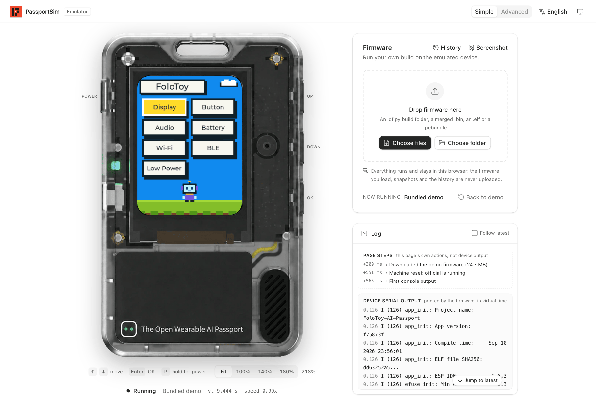
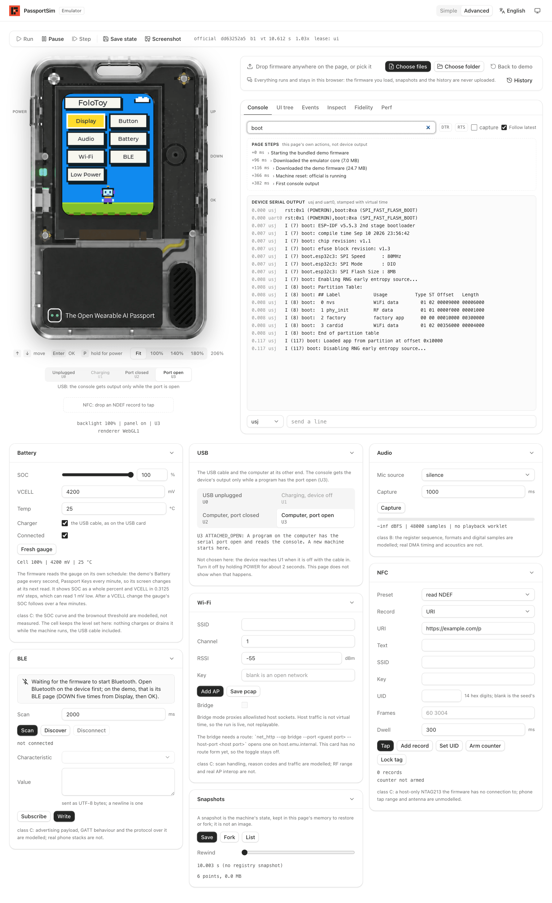
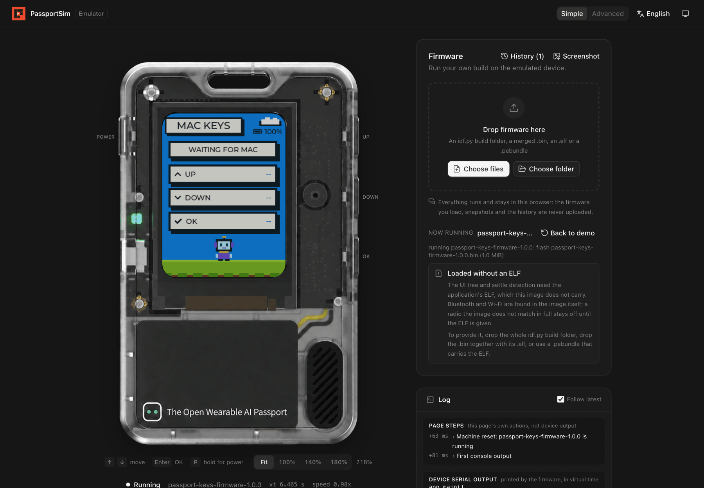
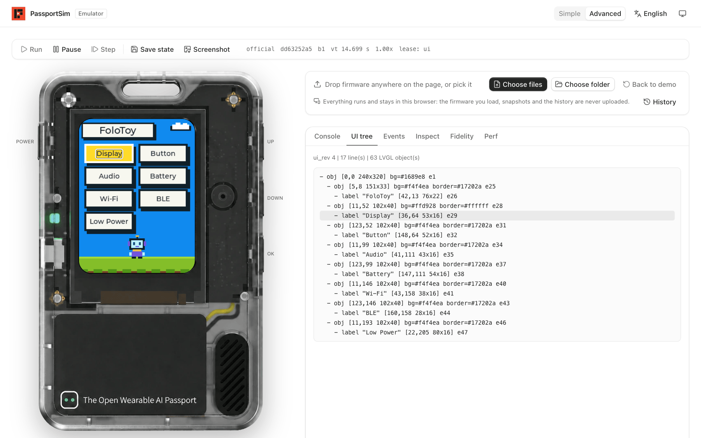

<div align="center">

<h1 align="center">
  <picture>
    <source media="(prefers-color-scheme: dark)" srcset="docs/images/logo-full-dark.svg">
    
  </picture>
</h1>

**Develop and debug FoloToy AI Passport firmware without the device.**<br>
Run unmodified ESP-IDF firmware in your browser or on your desktop.

**Try it online: [passportsim.bugs.cc](https://passportsim.bugs.cc)**, nothing to install.

[](LICENSE)


**English** | [简体中文](docs/i18n/zh-CN/README.md) | [日本語](docs/i18n/ja/README.md) | [Français](docs/i18n/fr/README.md)



</div>

## What you can do

- **Run firmware without a device.** Drop a build onto the page; the screen, buttons, sound and
  serial console work as on the board.
- **Debug it.** Pause, step, save and restore state, read the console, the UI tree, tasks and
  memory.
- **Try other people's firmware.** Any merged `.bin`, `idf.py` build folder or `.pebundle` runs as
  is. Nothing is uploaded; everything stays in your browser.
- **Automate it.** A command line and an MCP server for scripts, CI and AI agents.

## Quick start

The quickest way is the [online version](https://passportsim.bugs.cc): open it and drop your
firmware on the page.

Install the CLI from the latest release:

```sh
curl -fsSL https://passportsim.bugs.cc/install.sh | sh      # macOS (Apple silicon)
```

```powershell
irm https://passportsim.bugs.cc/install.ps1 | iex           # Windows x64 (PowerShell)
```

To build and run it from a checkout you need [Rust](https://rustup.rs), [Bun](https://bun.sh) and [just](https://github.com/casey/just)
(or `make`).

```sh
just setup    # once
just run      # build and open the web UI at http://127.0.0.1:4173/
```

Other commands:

| Command | What it does |
|---|---|
| `just cli start --fw official` | Run the command line with any arguments |
| `just test` | Unit tests |
| `just package` | Build a release package for this computer into `target/package/` |
| `just deploy` | Publish the web UI to Cloudflare Workers |
| `just` | List every command |

With `make`, pass arguments as variables: `make run PORT=8080`, `make cli ARGS="start"`.

## In the browser

- **Simple mode** opens first: the device, a place to drop your firmware, and a log.
- **Advanced mode** adds run control, the serial console, the UI tree, event recording, and
  cards for battery, USB, audio, NFC, Wi-Fi and Bluetooth.

The page is available in English, Chinese, Japanese and French, in light and dark themes.

<div align="center">

<br><sub>Advanced mode: run control, the serial console (filtered to <code>boot</code>), and the cards for battery, USB, audio, Wi-Fi, Bluetooth, NFC and snapshots</sub>
</div>

<div align="center">

<br><sub>Loading your own firmware (here Passport Keys)</sub>
</div>

## From the command line

```sh
just package
cd target/package/passportsim-*-macos-arm64
./passportsim start                  # boot the demo
./passportsim start path/to/firmware.bin
./passportsim screenshot             # save the screen as a PNG
./passportsim serial read            # read the console
./passportsim stop
```

On Windows the binary is `passportsim.exe`. The [quickstart](docs/quickstart.md) covers first
launch on each system.

## With AI agents

`passportsim mcp` is an MCP server. Add it to your MCP client:

```json
{ "mcpServers": { "passportsim": { "command": "/path/to/passportsim", "args": ["mcp"] } } }
```

The agent can boot a build, press buttons, wait for a console line, read the UI tree and take
screenshots. Add the [agent skill](skills/passportsim/SKILL.md) with
`npx skills add BlackHole1/passportsim`, or copy `skills/passportsim/` into your agent's skills
directory.

<div align="center">

<br><sub>The UI tree an agent reads, with the hovered widget outlined on the screen</sub>
</div>

## Supported systems

| | |
|---|---|
| macOS on Apple silicon | Supported |
| Windows 10 or newer, x64 | Supported |
| Browsers | Chrome, Edge, Firefox and Safari |
| Linux | Not supported |

## Learn more

| | |
|---|---|
| [How it works](docs/overview.md) | What is emulated, the architecture, determinism and fidelity |
| [Quickstart](docs/quickstart.md) | Packages, first launch, the daemon, the web bundle, Windows |
| [Commands](docs/commands/) | Every command with its arguments and errors |
| [Deploying to Cloudflare](docs/deploy-cloudflare.md) | Publishing the web UI as a static site |
| [Architecture](docs/ARCHITECTURE.md) | The full design |

## Contributing and license

Contributions are welcome; see [CONTRIBUTING.md](CONTRIBUTING.md) and the
[Code of Conduct](CODE_OF_CONDUCT.md). Report security issues as described in
[SECURITY.md](SECURITY.md).

MIT, see [LICENSE](LICENSE). Third-party material is listed in [THIRD_PARTY.md](THIRD_PARTY.md).
FoloToy, AI Passport, Espressif and ESP32 are names of their respective owners.
