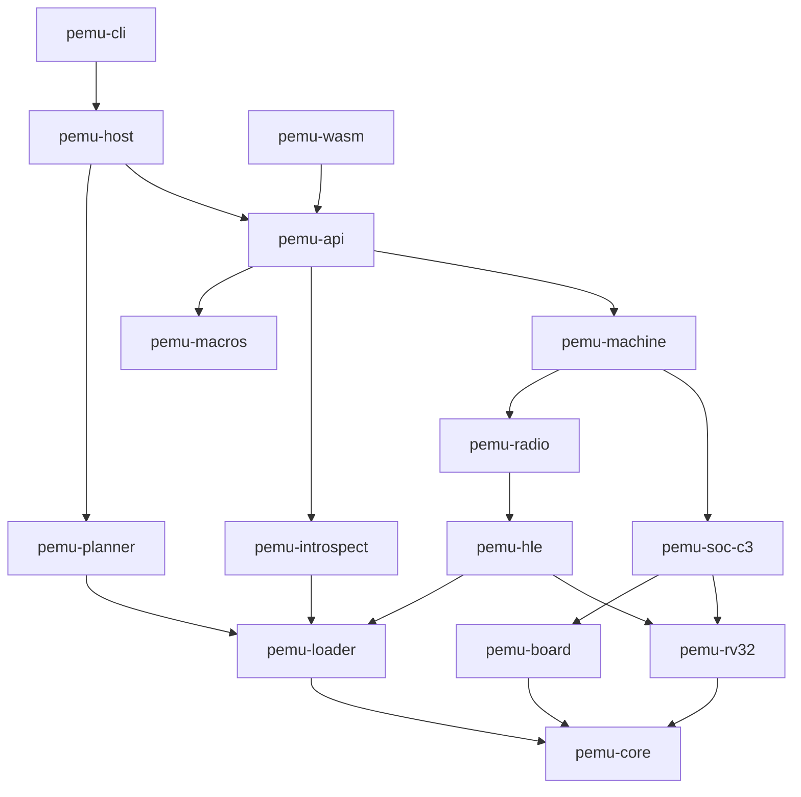
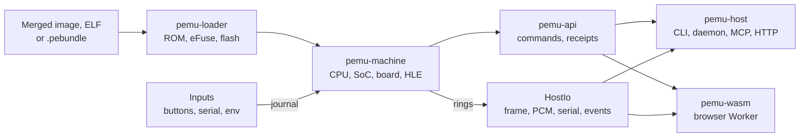

# Architecture

**English** | [简体中文](i18n/zh-CN/ARCHITECTURE.md) | [日本語](i18n/ja/ARCHITECTURE.md) | [Français](i18n/fr/ARCHITECTURE.md)

PassportSim emulates the FoloToy AI Passport: an ESP32-C3 (rev v1.1, RV32IMC) board with an
ST7789 display, an ES8311 audio codec, a CW2017 battery gauge, ADC buttons, an NFC card and USB
Serial/JTAG. It runs the same merged flash image the device runs, starting from the chip's real
mask ROM, and it runs the same core natively and in the browser.

This document describes the current design and the reasons that still constrain it. The code is
the primary source; where this document and the code disagree, the code wins and this document
is corrected.

## Goals and principles

- **The same image as the device.** The real rev v1.1 ROM runs unmodified, followed by the
  second-stage bootloader and the application. Nothing in the firmware is patched.
- **One core, many surfaces.** One set of crates builds for native targets and for
  `wasm32-unknown-unknown`. The CLI, MCP server, HTTP and WebSocket API, scenarios, the browser
  page, the generated docs and the agent skill are all generated from one command registry.
- **Virtual time is the only time inside the core.** The guest never sees host time, so a run is
  a pure function of its inputs.
- **Fail closed and name the failure.** An unmodeled register, a radio binding mismatch, a stuck
  poll loop or an unwakeable wait stops the run with a named error rather than guessing.
- **Fidelity is reported, never implied.** Every response carries a receipt that says what was
  modeled exactly, what was approximated, and what was touched but not modeled.
- **Secrets never leave by default.** Device identity, calibration data and card contents do not
  enter the repository, logs, exports or agent-visible output (`docs/secrets.md`).
- **Small files with one owner each.** One file per peripheral, board chip and command, and
  registries that each entry joins from its own file, so parallel changes rarely collide.

Non-goals: cycle-accurate pipeline timing beyond the calibrated `device` profile; emulating the
radios' RF, PHY or MAC registers or running the closed radio libraries; appearing as a host serial
device (serial tools connect over TCP); Linux and Intel Mac hosts; a GDB remote stub.

## Repository layout

| Path | Contents |
|---|---|
| `crates/` | The Rust workspace (next section) |
| `web/` | The browser page: TypeScript, React, built and tested with Bun, Playwright end-to-end tests |
| `specs/` | Behavior data with a citation per row: register CSV, per-block TOML, timing profiles, HLE binding profiles, notes |
| `boards/ai-passport.toml` | Board description: clocks, flash part, straps, pins, battery and power parameters |
| `assets/rom/` | The Espressif ROM ELFs (Apache-2.0), embedded into the binary, with pins and license |
| `probes/` | ESP-IDF probe firmware run on real silicon to measure behavior; the built ELFs are committed |
| `tests/` | Workspace tests (`tests/milestones/`), goldens, scenarios, transcripts, fixtures |
| `tools/oracle/` | Scripts that run Espressif QEMU as a black-box oracle (macOS only) |
| `skills/passportsim/` | The agent skill shipped with every package |
| `xtask/` | Developer tasks: code generation, checks, CI tiers, benchmarks, packaging |
| `docs/` | This document, the overview, quickstart, secrets policy, the generated command reference, and translations in `docs/i18n/` |

## Crates

| Crate | Responsibility |
|---|---|
| `pemu-core` | Virtual time, clock, scheduler, deterministic RNG, input journal, register storage, host I/O rings, snapshot codec, trace records, shared AES |
| `pemu-rv32` | Decoder, ops, CSRs, traps, PMP, the block-cache engine, the reference single-step interpreter, the cost model, the `Bus` trait |
| `pemu-soc-c3` | Memory arena, page table, MMU and cache, flash store, MMIO map, interrupt matrix, DMA view, one file per peripheral and one per cross-block wiring effect, generated register tables |
| `pemu-board` | Board chip traits and the Passport chips: panel, backlight, codec, gauge, battery, button ladder, power rail, USB plug, NFC tag |
| `pemu-loader` | ELF and symbols, ESP image and app descriptor, partition table, bundled ROMs and their pins, eFuse synthesis and import, `.pebundle` |
| `pemu-hle` | High-level emulation: hook sets, magic return PCs, binding, nested guest calls, continuations, tripwires, symbol recovery from images |
| `pemu-radio` | BLE controller over VHCI, virtual air and central, Wi-Fi driver model, virtual LAN (smoltcp), heap ledger |
| `pemu-machine` | Composition, run loop, stops, poll and ROM-delay fast-forward, hang and deadlock detection, sleep, snapshot, fork, state hash |
| `pemu-introspect` | DWARF layouts, unwinding, FreeRTOS, heap and LVGL walkers, panic decoding, redacted NVS listing |
| `pemu-api` | Command registry and commands, session pool, output shaping, redaction, matchers, receipts, scenarios, clock leases, host seams |
| `pemu-macros` | `#[command]` registration |
| `pemu-planner` | Pure flash-plan builder and refusal rules; real-device execution behind feature `device` |
| `pemu-host` | Native host: daemon and pool, host directories, platform services, MCP, HTTP and WebSocket, USB Serial/JTAG endpoints, relay, artifacts, boot cache |
| `pemu-cli` | The `passportsim` binary |
| `pemu-wasm` | The raw C ABI the browser Worker calls, and the ring layout shared with TypeScript |
| `pemu-testkit`, `pemu-verify` | Test support: corpus locator, register harness, mock board and machine, golden runner, console normalizer, bands, trace and oracle diffs, calibration fit |
| `tests/milestones` (`pemu-milestones`) | Integration tests that boot real images, one test target per file |

### Layering



Edges are transitive: a crate may depend on anything it reaches. `cargo xtask layering` checks
these rules:

1. **Core crates build for wasm and touch no host.** Every crate except `pemu-host`, `pemu-cli`,
   the test crates, `xtask` and `pemu-planner` with feature `device` builds for
   `wasm32-unknown-unknown` and uses no `std::time`, `std::thread`, `std::fs`, `std::env`,
   `std::net` or `std::process`, no platform math functions and no state-affecting hash-map
   iteration.
2. **A peripheral never names another peripheral.** Cross-block effects (DMA, clock changes,
   interrupts, resets) go through `Wiring` variants the machine applies.
3. **Board chips never read SoC registers**, and the SoC names only board traits.
4. **HLE and radio code reach the host only through `HostIo` rings and journaled inputs.**
5. **Only `pemu-planner` with feature `device` opens a serial device.** Everywhere else
   `pemu_host::paths::refuse_device` refuses device paths (`/dev/cu.*`, `COM<n>`, the `\\.\`
   namespace) before any open.
6. **Host-specific code lives in `pemu_host::platform`**, and directory roles in
   `pemu_host::paths`; no other crate carries a `cfg(target_os)`.
7. **Third-party licenses** are limited to the permissive set in `deny.toml`; GPL, LGPL, AGPL and
   unlicensed crates are refused.

## Data flow



- **Loading.** The loader builds the ROM image from the bundled ELF that the eFuse chip revision
  selects, checks its SHA-256 pin, synthesizes a default eFuse (placeholder MAC, block revision
  that lets ADC calibration initialize) unless a dump is given, and maps the flash image.
  Overrides (`--rom`, `PASSPORTSIM_ROM`, config) are native only.
- **Inputs** (buttons, serial bytes, USB line state, microphone chunks, network frames, HCI
  packets) are stamped with a virtual time and appended to the journal. Models consume only
  journaled input, so a session and its replay see the same bytes at the same instants. There is
  one append site, `Machine::input_from`, and each input records its origin (endpoint, UI, bridge).
- **Outputs** leave through fixed-capacity rings in core memory: frame buffer, audio out, both
  consoles and events. In wasm they sit in linear memory and the Worker reads them through typed
  views, so nothing crosses the JavaScript boundary per byte or pixel.
- **Commands** are the only control path. The UI, the CLI and an agent all call the same
  registry, so a UI session's journal equals an agent's.

## Core abstractions

- **Engine.** Blocks end at control-flow and CSR ops, after 64 instructions or at a 4 KB page
  boundary, and are dispatched by a `match` on the op kind. Traps are precise, instruction budgets
  are exact, interrupts are taken only between `run` calls, and block boundaries are unobservable,
  so the block cache is derived state and never snapshotted. The engine and `ref_step` are fuzzed
  against each other at block sizes 1, 3 and 64.
- **Memory.** One arena holds ROM, SRAM, RTC RAM and the 8 MB flash. A page table gives fast loads
  and stores; MMIO, cold pages and split-permission pages take the slow path. Accesses keep their
  size and byte offset: nothing widens a narrow write into a read-modify-write.
- **Peripherals.** `periph/mod.rs` holds one `c3_devices!` table (name, base, size, model) from
  which the MMIO map, snapshot sections and reset fan-out are generated. A block with no model yet
  is `StoreOnly`: reads return stored values, writes are stored, and the first touch of each
  register is recorded in the fidelity ledger.
- **Board.** Chips implement `I2cDevice`, `SpiDevice`, `I2sCodec` and friends behind
  `BoardPorts`; values come from `boards/ai-passport.toml` with citations in `specs/`.
- **HLE.** Hooked functions become engine hook terminators. Handlers are serializable state
  machines that may call back into the guest through magic return PCs in an unused ROM gap, with
  guards against stack overflow and against resuming a deleted task.
- **Machine facade.** `MachineApi` (run, input, io, now, guest memory, receipt, taint) is object
  safe; `SnapshotMachine` adds snapshot, restore, fork, redaction and `state_hash`. Stops are one
  `StopSet` of breakpoints, watches and matchers.
- **Snapshots.** Every section has a version and a golden-bytes test; `FORMAT_VERSION` in
  `pemu-core/src/snap.rs` bumps on any section layout change. Derived state (block cache, page
  table, hooks) is rebuilt, never saved. A snapshot of another run identity is refused with
  `SnapError::IdentityMismatch`. While a live bridge is attached, restore and rewind are refused
  and fork needs an explicit policy, because the host peer is not in the snapshot.
- **Commands.** A command is one file under `pemu-api/src/commands/` with argument and output
  types, a handler, a text renderer and an example. Native builds register it through `linkme`,
  wasm through a list `pemu-wasm/build.rs` generates. Error codes are grouped in ranges per caps
  group (core below 1000, audio 1000, radio 2000, NFC 3000, debug 4000, device 5000, power 6000);
  a shipped code keeps its name and number.

### Frozen interfaces

These types are shared by many files and change only deliberately: `Bus`, `Op`, `Peripheral`,
`Cx`, `Wiring`, `RegStore`, `HostIo`, the snapshot codec and `snap_struct!`, the board chip
traits, `GuestView`, `MachineApi`, `SnapshotMachine`, the stop shapes, `CommandSpec`, `Output`,
`ApiError`, the receipt, and the wasm ABI with `pemu_wasm::layout`. The extension points
`RadioModule`, `IdlePolicy`, `OpFuser` and `ExecTier` each have a no-op default that is always a
valid answer.

A change to a frozen interface goes in its own pull request, before any code that uses it, with
the reason in the description and this document updated in the same change. Adding a method with
a default body, or an error code inside its range, needs no separate change. `ABI_VERSION` bumps
on any change to the wasm functions or layouts; `FORMAT_VERSION` on any snapshot layout change.

## Execution and time

The run loop applies due journal inputs, dispatches due events, checks stops, handles WFI and
interrupts, then runs the engine for a budget that ends at the next event or limit. Any access
that changes what is due returns `OkStop`, so no event fires late. Wall-clock pacing lives outside
`run`: the host passes a virtual-time limit and checks wall time between calls.

- **Virtual time** advances with the clock position: retired instructions plus their per-class
  extra cycles. Counters (SYSTIMER, TIMG, RTC, watchdogs) are computed from virtual time on read
  and schedule their alarms as events; nothing ticks.
- **WFI and light sleep** jump to the next event. Deep sleep resets the CPU and keeps the RTC
  domain. The CPU leaves reset at half the crystal frequency.
- **Timing profiles** are data in `specs/timing-profiles.toml` and part of run identity. `fast`
  (the default) completes device operations at once and charges one cycle per instruction.
  `device` is calibrated against probe captures from real silicon: per-class instruction costs
  (taken branch, jump, load-use, divide, MMIO bus cycles), a 16 KB 8-way FIFO flash cache with
  streaming fills and fetch read-ahead, SRAM bank conflicts, and bus times for flash, SPI, I2C,
  SHA, ADC and the USB drain. It is band-accurate, not cycle-accurate.
- **Poll fast-forward.** When an MMIO poll loop repeats with identical architectural state
  (same PC, address, value and registers, no stores, events, hooks or time reads in between), the
  machine skips whole iterations up to the next event that can change the value. It is on by
  default and changes no result; the canonical trace records polls as runs either way.
- **ROM delay fast-forward.** The ROM's `ets_delay_us` loop is skipped by whole iterations, keeping
  the cycle counter and every register exactly as execution would. The hook is keyed to the ROM's
  SHA-256.
- **Hang and deadlock detection.** A poll on a register nothing can change, or one unchanged for
  longer than `stuck_ms` of virtual time, stops with `E_STUCK` naming the busy-wait row. A hart in
  WFI that no routed interrupt or pending event can wake, or a cycle of FreeRTOS tasks waiting on
  each other's mutexes, stops with `E_DEADLOCK` at the instant the wait became unwakeable.
  `Deadlock` means the guest waits for input.
- **Pacing** is `Paused` between agent calls, `Max` for agents, scenarios and CI, `Wall` for
  interactive use, and `Audio` while the browser plays sound. Falling more than 250 ms behind
  re-anchors: the guest runs in slow motion and virtual time never jumps. One holder at a time
  owns the clock lease (agent, UI, endpoint or scenario). A live bridge (real network, external
  HCI, live microphone) fixes pacing at real time, because its peer answers in host time.

## Determinism

- **Run identity** is the ROM, flash image, app ELF and eFuse hashes, the `MachineConfig` hash
  (board, profile, seed, scripted world, hang settings) and the input journal. Text inputs are
  hashed over their parsed structure, never their file bytes, so line endings and key order do not
  change identity.
- **Equal identity gives bit-identical output:** console bytes, canonical MMIO and interrupt
  traces, frames, PCM and `state_hash`.
- **Results do not depend on** the host (macOS, Windows, Node, Chrome, Edge, Firefox, Safari),
  build profile, block size, slice size, fast-forward, tracing, pacing, pause points or snapshot
  points.
- **Forbidden in state paths:** host clocks, host randomness, hash-map iteration, threads, float
  NaN payloads and the platform math library, whose last bits differ between hosts (denied by
  `clippy.toml`; the portable `libm` crate is used where floats are needed). Guest entropy comes
  from a seeded `DetRng`.
- **Nondeterministic sources are journaled.** Receipts say `deterministic`, `replayable` or
  `live`.
- **Cross-host parity.** `tests/milestones/cross_host/` boots a synthetic image over the bundled
  ROM under both profiles and compares every digest, snapshot bytes included, with the committed
  golden `tests/golden/cross-host/parity.txt`, recorded on macOS. Every host checks it in its T0.

## Radios

BLE and Wi-Fi are emulated at the driver boundary; everything above it runs as real guest code.

| Radio | Replaced | Stays real |
|---|---|---|
| BLE | The seven VHCI controller functions of `bt.c` | NimBLE host, GATT, SMP, the application |
| Wi-Fi | `esp_wifi_init`/`deinit`, the public `esp_wifi_*` API and the data-plane hooks | lwIP, esp_netif, DHCP, mbedTLS, HTTP client |

- **Binding is exact or nothing.** A module binds only when every hooked function matches its
  profile in `specs/hle/idf-5.5.3/` by size and a relocation-masked code hash, and the app's IDF
  version matches. A mismatch marks the radio `unsupported image` and the rest keeps running.
- **Without an ELF** the symbols are recovered from the image by whole-body code shapes; a module
  binds only if all its names are found exactly once. Wi-Fi without an ELF binds only this way.
- **Tripwires** on the closed-library internals stop a run that reaches them with `E_TRIPWIRE`
  instead of an obscure assert.
- **The world is scripted.** A virtual BLE central scans, connects and uses GATT; Wi-Fi joins
  scripted open or WPA2-PSK access points on a virtual LAN. An allowlisted port bridge and an
  external HCI peer connect to the real world from the native host; both are live bridges.

## Host surfaces

- **Generated surfaces.** The CLI (`passportsim <cmd>`), MCP tools (`passport_<cmd>`), HTTP
  (`POST /v1/instances/{id}/commands/{name}`), WebSocket, scenario steps, TypeScript types, the
  command reference and the skill all come from the registry. Command examples are stored as argv
  arrays and run in CI without a shell. The default MCP tool list is capped at 24 KB of JSON; the
  audio, radio, NFC, power, debug and device groups are opt-in with `--caps`.
- **Host availability** is one table, `pemu_api::host_support::TABLE`. A command a host cannot run
  fails with `E_HOST_UNSUPPORTED` naming the alternative, and generated docs show the full matrix,
  so they are identical on every host.
- **Host seams.** `pemu-api` is a core crate, so artifacts, scenario files, the machine factory,
  the clock and endpoints reach it through seams the host fills at start-up
  (`pemu_host::backend::install`, `hooks::install`). An unfilled seam is a runtime refusal naming
  its installer.
- **Outputs are token-efficient.** Serial reads are cursor-based deltas; the UI tree is a pruned
  text form with diffs; large data goes to artifact files returned by path and hash. Artifact paths
  are relative to the artifacts root with forward slashes; only `status` reports the root.
- **Daemon.** `passportsim start` spawns `passportsim serve --headless` detached when none runs, so
  agent calls share instances across invocations. Discovery is a file in the runtime directory
  holding the port and a bearer token; staleness is detected by connecting, never by process id.
  The daemon exits after 10 idle minutes. Each instance runs on its own thread with an 8 MiB stack.
- **Servers.** HTTP, WebSocket, MCP streamable HTTP and the static UI share one loopback listener
  that needs the bearer token or a session cookie, checks `Host` and `Origin`, and sends
  COOP/COEP headers. The CLI opens the UI with a single-use launch code in the URL fragment that is
  exchanged for an `HttpOnly`, `SameSite=Strict` cookie.
- **USB Serial/JTAG endpoints.** A TCP endpoint detects RFC 2217, raw esptool SLIP or a plain
  console from the first bytes. Flash with `rfc2217://127.0.0.1:<port>` (esptool cannot drive the
  reset sequence over `socket://`); monitor with either. A pty endpoint exists on macOS only.
- **Host directories** (config, data root, cache, runtime, logs, artifacts) are resolved only by
  `pemu_host::paths::HostPaths`: `~/.config/passportsim` and
  `~/Library/Application Support/passportsim` on macOS, known folders (never environment
  variables) on Windows. `PASSPORTSIM_HOME`, `PASSPORTSIM_CONFIG_DIR` and `PASSPORTSIM_DATA_ROOT`
  override them; the secrets guard ignores the overrides. Private files are owner-only from
  creation.
- **External tools** (esptool, the IDF toolchain) are resolved from explicit flags and the IDF
  environment, never through `PATH`, and are never run through `.bat`, `.cmd` or `.ps1` shims.

### Flashing a real device

Real-device flashing is native CLI only, in a build with feature `device`, on macOS or Windows.
The steps run in a fixed order so that nothing touches the device before the plan is proven:
discover (enumerate by VID/PID without opening a port), plan (pure, offline), rehearse (the same
esptool invocation against an emulator with the real partition layout), confirm, identify,
guard the `cardid` region, back up every sector to be written, write, verify, and boot-check. The
planner never writes `nvs`, `phy_init` or `cardid`, never erases the whole chip and never writes
eFuses; a changed `cardid` digest stops with `E_CARDID_CHANGED`.

## Web page

```text
Main thread (React)          Emulator Worker (wasm core)           AudioWorklet
 device, panels, input  -->   input: SAB ring or postMessage        playback ring -> output
 console, log           <--   pacing loop, slices of about 8 ms     microphone -> ring
                              OffscreenCanvas WebGL frame
```

- **Runtime.** The core is single-threaded in a dedicated Worker. SharedArrayBuffer rings are used
  between the JavaScript parties when the page is cross-origin isolated, with a `postMessage`
  fallback otherwise. Timers are coarse in every engine, so the Worker waits with `Atomics.wait`
  and yields with `Atomics.waitAsync` (MessageChannel when that is missing).
- **UI.** React with vendored coss ui components (MIT) and Tailwind, no CDN, and a flat build
  (`index.html`, `styles.css`, `main.js`, `worker.js`, `worklet.js` and the three icons from
  `web/public/`). Simple mode shows the device, a firmware card and a log; advanced mode adds run
  control, console, UI tree, events, inspect, fidelity and environment cards. English, Simplified Chinese, Japanese and French; the first
  visit follows the system locale.
- **The device view** is FoloToy's front product photo of the AI Passport (see `THIRD_PARTY.md`),
  with the emulated glass over the photo's screen and the side buttons as the controls
  (`web/src/app/skinGeometry.ts` holds the geometry). Zoom is fit, 100, 140 or 180 % of the
  60 x 95 mm body; fit does not drop below 140 % while the column is wide enough, so the firmware's
  text stays readable. An `Emulator` badge stays on screen so a screenshot is never mistaken for a
  device photo. Buttons send press and release edges held for at least 80 ms of guest time.
- **Every control calls a registry command**, and each logged action can be copied as a CLI
  command or a scenario step.
- **Nothing leaves the browser.** The page makes GET requests for its own files only. Firmware,
  snapshots, screenshots and the firmware history (IndexedDB, at most 12 entries or 160 MiB)
  stay local.
- **A stop is always stated.** A panic, tripwire, halt or unwakeable wait shows the reason and
  offers a restart or continue; input is disabled while stopped.
- **Loading.** The page boots the bundled demo with no input. A dropped `idf.py` build folder,
  merged bin, ELF or `.pebundle` replaces it.

## Packaging

`cargo xtask package --target <triple>` builds one self-contained binary per host:
`passportsim-<version>-macos-arm64.tar.gz` and `passportsim-<version>-windows-x64.zip`. The binary
embeds the web page, the wasm core of the same commit, the schemas, the skill, the bundled ROMs
and the prebuilt demo; the embedded payload is byte-identical across hosts and its hash is in the
package receipt. Windows builds link statically against the CRT and embed a manifest declaring
long-path awareness and the UTF-8 code page; the package check fails if the binary imports the
Visual C++ runtime. The same command writes a static web bundle and a Cloudflare Workers project
for it (`docs/deploy-cloudflare.md`).

## Security

The full policy is `docs/secrets.md`. In short: no MAC address, unique ID, calibration word,
backup file name or card content enters the repository or an agent-visible output; examples use
the `02:00:00` MAC prefix. One builder, `pemu_api::secret_set`, feeds both the redaction pass and
`cargo xtask secrets-check`, which the git hooks run on every commit and push. Machines built
from a real eFuse dump are tainted: their exports are redacted and their boot cache stays in
memory.

## Verification

| Layer | What | Where |
|---|---|---|
| Unit and model tests | Generated register tests, peripheral harnesses, board chips against datasheet sequences, I2C transcripts | Each crate |
| CPU conformance | riscv-tests, ESP CSR tests, objdump decode of every ROM and corpus instruction, engine against `ref_step` fuzz | `pemu-rv32`, `xtask riscv-tests` |
| Golden boots and scenarios | Console text against device lines and bands, frames against PNG goldens, scripted scenarios | `tests/milestones`, `tests/golden`, `tests/scenarios` |
| Determinism | Run twice, block and slice size, fast-forward on and off, stop invariance, snapshot anywhere, restore equivalence, native against wasm, cross-host parity | `pemu-machine`, `xtask ci` |
| Oracle diffs | Write streams and call traces against Espressif QEMU run as a black box | `pemu-verify`, `xtask oracle` (macOS) |
| Browser | Playwright in Chromium, Firefox and WebKit on macOS; Chromium, Chrome, Edge and Firefox on Windows | `web/tests` |
| Performance | Workload benchmarks with a 10 % regression gate, browser CPU share | `xtask bench`, `xtask bench-browser` |

- **Spec tables.** `specs/c3-registers.csv` and `specs/blocks/<block>.toml` (reset domains,
  busy-wait rows, overrides) are merged by `cargo xtask codegen` into generated register tables
  and `docs/fidelity.md`. Every row cites its source; `cargo xtask provenance` checks the
  citations and the clean-room rules (`CONTRIBUTING.md`).
- **Fidelity classes.** A: matches the device (a test tied to a capture). B: matches the spec and
  an oracle or an IDF-derived test. C: a declared approximation. U: unmodeled. A class goes up only
  with the test that proves it.
- **Probe firmware** in `probes/` measures silicon behavior (timing, resets, clocks, interrupts,
  radios) and prints machine-readable lines that the model is fitted and checked against.
- **CI tiers.** `cargo xtask ci t0` needs no corpus or device data and runs on every host. `t1`
  adds the firmware corpus, goldens and browser runs; `t2` adds long determinism runs, oracle
  diffs and benchmarks. Tests join a tier by name: `t1_*` and `t2_*` tests run in their tier, and
  T0 runs the whole workspace. Each run writes a JSON receipt.
