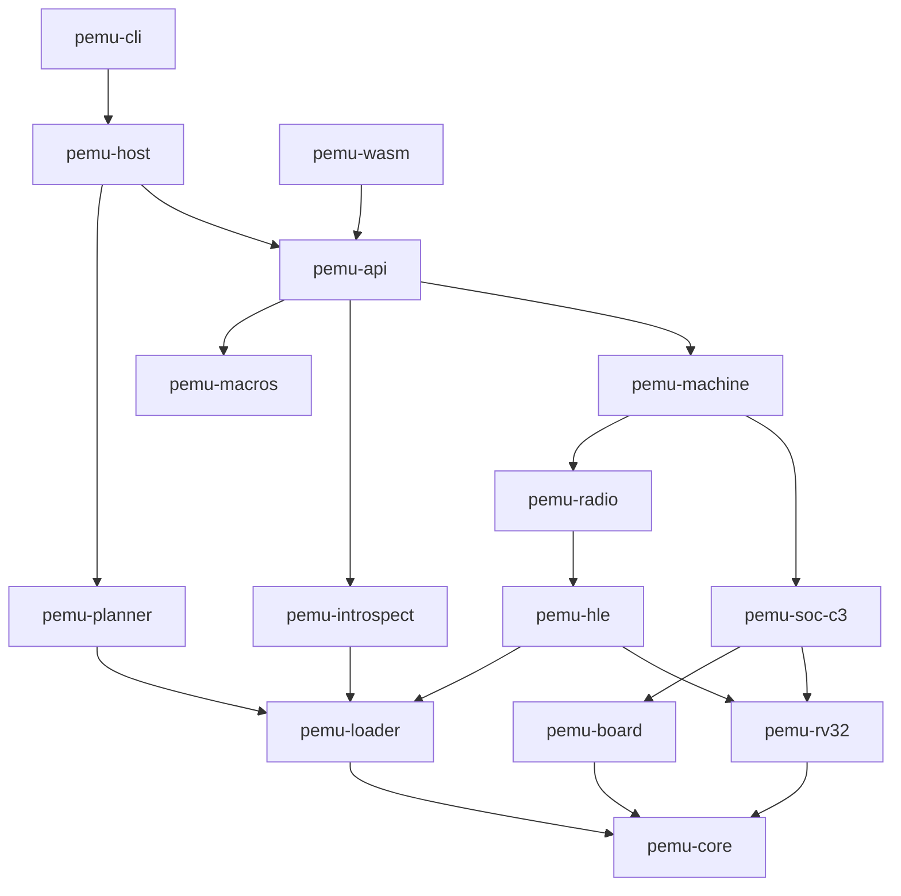
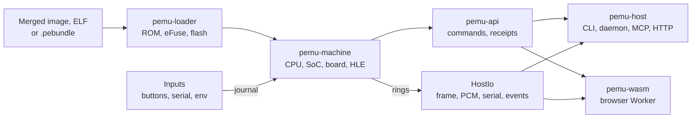

# Architecture

[English](../../ARCHITECTURE.md) | [简体中文](../zh-CN/ARCHITECTURE.md) | [日本語](../ja/ARCHITECTURE.md) | **Français**

PassportSim émule le FoloToy AI Passport : une carte ESP32-C3 (rev v1.1, RV32IMC) avec un écran
ST7789, un codec audio ES8311, une jauge de batterie CW2017, des boutons sur ADC, une carte NFC et
l'USB Serial/JTAG. Il exécute la même image flash fusionnée que l'appareil, à partir de la vraie
ROM masquée de la puce, et le même cœur tourne en natif et dans le navigateur.

Ce document décrit la conception actuelle et les raisons qui la contraignent encore. Le code est la
source de référence : quand ce document et le code divergent, le code l'emporte et ce document est
corrigé.

## Objectifs et principes

- **La même image que l'appareil.** La vraie ROM rev v1.1 s'exécute sans modification, suivie du
  bootloader de second niveau et de l'application. Rien n'est patché dans le firmware.
- **Un cœur, plusieurs interfaces.** Un même ensemble de crates compile pour les cibles natives et
  pour `wasm32-unknown-unknown`. La ligne de commande, le serveur MCP, l'API HTTP et WebSocket, les
  scénarios, la page web, la documentation générée et la compétence pour agents sont tous générés à
  partir d'un seul registre de commandes.
- **Le temps virtuel est le seul temps à l'intérieur du cœur.** L'invité ne voit jamais l'heure de
  l'hôte : une exécution est une fonction pure de ses entrées.
- **S'arrêter et nommer l'échec.** Un registre non modélisé, une radio qui ne se branche pas, une
  boucle d'attente bloquée ou une attente impossible à réveiller arrêtent l'exécution avec une
  erreur nommée au lieu de deviner.
- **La fidélité est déclarée, jamais sous-entendue.** Chaque réponse porte un reçu qui dit ce qui a
  été modélisé exactement, ce qui a été approché, et ce qui a été touché sans être modélisé.
- **Les secrets ne sortent jamais par défaut.** L'identité de l'appareil, les données de
  calibration et le contenu des cartes n'entrent ni dans le dépôt, ni dans les journaux, ni dans les
  exports, ni dans les sorties visibles par un agent (`docs/secrets.md`).
- **De petits fichiers avec un seul propriétaire chacun.** Un fichier par périphérique, par puce de
  la carte et par commande, et des registres que chaque entrée rejoint depuis son propre fichier :
  les modifications parallèles entrent rarement en conflit.

Hors objectifs : un timing de pipeline exact au cycle au-delà du profil calibré `device` ;
l'émulation des registres RF, PHY ou MAC des radios, ou l'exécution des bibliothèques radio
fermées ; apparaître comme un périphérique série de l'hôte (les outils série se connectent en
TCP) ; les hôtes Linux et Mac Intel ; un stub GDB distant.

## Organisation du dépôt

| Chemin | Contenu |
|---|---|
| `crates/` | Le workspace Rust (section suivante) |
| `web/` | La page web : TypeScript, React, compilée et testée avec Bun, tests de bout en bout Playwright |
| `specs/` | Données de comportement avec une citation par ligne : CSV des registres, TOML par bloc, profils de timing, profils de liaison HLE, notes |
| `boards/ai-passport.toml` | Description de la carte : horloges, modèle de flash, broches de configuration, broches, paramètres de batterie et d'alimentation |
| `assets/rom/` | Les ELF de ROM d'Espressif (Apache-2.0), intégrés à l'exécutable, avec leurs empreintes et leur licence |
| `probes/` | Firmwares de sonde ESP-IDF exécutés sur du vrai silicium pour mesurer le comportement ; les ELF compilés sont versionnés |
| `tests/` | Tests du workspace (`tests/milestones/`), goldens, scénarios, transcriptions, fixtures |
| `tools/oracle/` | Scripts qui exécutent le QEMU d'Espressif comme oracle en boîte noire (macOS uniquement) |
| `skills/passportsim/` | La compétence pour agents livrée dans chaque paquet |
| `xtask/` | Tâches de développement : génération de code, contrôles, niveaux de CI, benchmarks, paquets |
| `docs/` | Ce document, la présentation, le démarrage rapide, la politique des secrets, la référence des commandes générée, et les traductions dans `docs/i18n/` |

## Crates

| Crate | Responsabilité |
|---|---|
| `pemu-core` | Temps virtuel, horloge, ordonnanceur, générateur aléatoire déterministe, journal des entrées, stockage des registres, anneaux d'E/S de l'hôte, codec d'instantanés, enregistrements de trace, AES partagé |
| `pemu-rv32` | Décodeur, opérations, CSR, traps, PMP, moteur à cache de blocs, interpréteur pas à pas de référence, modèle de coût, trait `Bus` |
| `pemu-soc-c3` | Arène mémoire, table de pages, MMU et cache, stockage flash, carte MMIO, matrice d'interruptions, vue DMA, un fichier par périphérique et un par effet de câblage entre blocs, tables de registres générées |
| `pemu-board` | Traits des puces de la carte et puces du Passport : dalle, rétroéclairage, codec, jauge, batterie, échelle de boutons, rail d'alimentation, prise USB, étiquette NFC |
| `pemu-loader` | ELF et symboles, image ESP et descripteur d'application, table des partitions, ROM fournies et leurs empreintes, synthèse et import d'eFuse, `.pebundle` |
| `pemu-hle` | Émulation de haut niveau : ensembles de hooks, PC de retour magiques, liaison, appels imbriqués dans l'invité, continuations, tripwires, récupération des symboles depuis les images |
| `pemu-radio` | Contrôleur BLE via VHCI, air et centrale virtuels, modèle de pilote Wi-Fi, LAN virtuel (smoltcp), registre du tas |
| `pemu-machine` | Assemblage, boucle d'exécution, arrêts, avance rapide des attentes actives et des délais de la ROM, détection de blocage et d'interblocage, veille, instantané, fork, empreinte d'état |
| `pemu-introspect` | Dispositions DWARF, déroulement de pile, parcours FreeRTOS, du tas et de LVGL, décodage des panics, liste NVS masquée |
| `pemu-api` | Registre des commandes et commandes, pool de sessions, mise en forme des sorties, masquage, comparateurs, reçus, scénarios, baux d'horloge, points d'injection de l'hôte |
| `pemu-macros` | Enregistrement `#[command]` |
| `pemu-planner` | Construction pure des plans de flashage et règles de refus ; exécution sur appareil réel derrière la fonctionnalité `device` |
| `pemu-host` | Hôte natif : démon et pool, dossiers de l'hôte, services de plateforme, MCP, HTTP et WebSocket, points d'accès USB Serial/JTAG, relais, artefacts, cache de démarrage |
| `pemu-cli` | L'exécutable `passportsim` |
| `pemu-wasm` | L'ABI C brute qu'appelle le Worker du navigateur, et la disposition des anneaux partagée avec TypeScript |
| `pemu-testkit`, `pemu-verify` | Support de test : localisation du corpus, banc de registres, carte et machine factices, exécuteur de goldens, normalisation de la console, bandes de tolérance, comparaisons de traces et avec l'oracle, ajustement de calibration |
| `tests/milestones` (`pemu-milestones`) | Tests d'intégration qui démarrent de vraies images, une cible de test par fichier |

### Couches



Les arêtes sont transitives : une crate peut dépendre de tout ce qu'elle atteint.
`cargo xtask layering` vérifie ces règles :

1. **Les crates du cœur compilent pour wasm et ne touchent pas à l'hôte.** Toutes les crates sauf
   `pemu-host`, `pemu-cli`, les crates de test, `xtask` et `pemu-planner` avec la fonctionnalité
   `device` compilent pour `wasm32-unknown-unknown` et n'utilisent ni `std::time`, ni
   `std::thread`, ni `std::fs`, ni `std::env`, ni `std::net`, ni `std::process`, ni les fonctions
   mathématiques de la plateforme, ni d'itération de table de hachage qui influe sur l'état.
2. **Un périphérique ne nomme jamais un autre périphérique.** Les effets entre blocs (DMA,
   changements d'horloge, interruptions, réinitialisations) passent par des variantes de `Wiring`
   qu'applique la machine.
3. **Les puces de la carte ne lisent jamais les registres du SoC**, et le SoC ne nomme que des
   traits de la carte.
4. **Le code HLE et radio n'atteint l'hôte que par les anneaux `HostIo` et les entrées
   journalisées.**
5. **Seul `pemu-planner` avec la fonctionnalité `device` ouvre un périphérique série.** Partout
   ailleurs, `pemu_host::paths::refuse_device` refuse les chemins de périphérique (`/dev/cu.*`,
   `COM<n>`, l'espace de noms `\\.\`) avant toute ouverture.
6. **Le code propre à l'hôte vit dans `pemu_host::platform`**, et les rôles de dossiers dans
   `pemu_host::paths` ; aucune autre crate ne porte de `cfg(target_os)`.
7. **Les licences tierces** se limitent à l'ensemble permissif de `deny.toml` ; les crates GPL,
   LGPL, AGPL et sans licence sont refusées.

## Flux de données



- **Chargement.** Le chargeur construit l'image de ROM à partir de l'ELF fourni que sélectionne la
  révision de puce de l'eFuse, vérifie son empreinte SHA-256, synthétise un eFuse par défaut (MAC
  fictive, révision de bloc qui permet d'initialiser la calibration de l'ADC) si aucun dump n'est
  fourni, et projette l'image flash. Les remplacements (`--rom`, `PASSPORTSIM_ROM`, configuration)
  n'existent qu'en natif.
- **Les entrées** (boutons, octets série, état de la ligne USB, morceaux de micro, trames réseau,
  paquets HCI) sont horodatées en temps virtuel et ajoutées au journal. Les modèles ne consomment
  que des entrées journalisées : une session et sa relecture voient donc les mêmes octets aux mêmes
  instants. Il n'y a qu'un point d'ajout, `Machine::input_from`, et chaque entrée enregistre son
  origine (point d'accès, interface, pont).
- **Les sorties** passent par des anneaux de capacité fixe dans la mémoire du cœur : framebuffer,
  sortie audio, les deux consoles et les événements. En wasm, ils vivent dans la mémoire linéaire
  et le Worker les lit par des vues typées : rien ne traverse la frontière JavaScript octet par
  octet ou pixel par pixel.
- **Les commandes** sont le seul chemin de contrôle. L'interface, la ligne de commande et un agent
  appellent tous le même registre : le journal d'une session d'interface est identique à celui
  d'un agent.

## Abstractions du cœur

- **Moteur.** Les blocs se terminent aux opérations de contrôle de flux et de CSR, après 64
  instructions ou à une frontière de page de 4 KB, et sont distribués par un `match` sur le type
  d'opération. Les traps sont précis, les budgets d'instructions exacts, les interruptions ne sont
  prises qu'entre deux appels à `run`, et les frontières de blocs sont inobservables : le cache de
  blocs est donc un état dérivé, jamais enregistré dans un instantané. Le moteur et `ref_step` sont
  confrontés par fuzzing avec des tailles de bloc de 1, 3 et 64.
- **Mémoire.** Une arène contient la ROM, la SRAM, la RTC RAM et les 8 MB de flash. Une table de
  pages accélère les lectures et écritures ; le MMIO, les pages froides et les pages à permissions
  mixtes passent par le chemin lent. Les accès conservent leur taille et leur offset : rien
  n'élargit une écriture étroite en lecture-modification-écriture.
- **Périphériques.** `periph/mod.rs` contient une table `c3_devices!` (nom, base, taille, modèle)
  d'où sont générés la carte MMIO, les sections d'instantané et la propagation des
  réinitialisations. Un bloc encore sans modèle est `StoreOnly` : les lectures renvoient les valeurs
  stockées, les écritures sont stockées, et le premier accès à chaque registre est consigné dans le
  registre de fidélité.
- **Carte.** Les puces implémentent `I2cDevice`, `SpiDevice`, `I2sCodec` et consorts derrière
  `BoardPorts` ; les valeurs viennent de `boards/ai-passport.toml`, avec leurs citations dans
  `specs/`.
- **HLE.** Les fonctions interceptées deviennent des terminaisons de hook du moteur. Les
  gestionnaires sont des machines à états sérialisables qui peuvent rappeler l'invité par des PC de
  retour magiques situés dans un trou inutilisé de la ROM, avec des protections contre le
  débordement de pile et la reprise d'une tâche supprimée.
- **Façade de la machine.** `MachineApi` (run, input, io, now, mémoire de l'invité, reçu,
  contamination) est object-safe ; `SnapshotMachine` ajoute instantané, restauration, fork,
  masquage et `state_hash`. Les arrêts forment un seul `StopSet` de points d'arrêt, de surveillances
  et de comparateurs.
- **Instantanés.** Chaque section a une version et un test sur des octets de référence ;
  `FORMAT_VERSION` dans `pemu-core/src/snap.rs` augmente à chaque changement de disposition d'une
  section. L'état dérivé (cache de blocs, table de pages, hooks) est reconstruit, jamais
  enregistré. Un instantané d'une autre identité d'exécution est refusé avec
  `SnapError::IdentityMismatch`. Tant qu'un pont en direct est branché, restauration et retour
  arrière sont refusés et le fork exige une politique explicite, car le pair côté hôte n'est pas
  dans l'instantané.
- **Commandes.** Une commande est un fichier sous `pemu-api/src/commands/` avec ses types d'argument
  et de sortie, un gestionnaire, un rendu texte et un exemple. Les builds natifs l'enregistrent via
  `linkme`, wasm via une liste que génère `pemu-wasm/build.rs`. Les codes d'erreur sont regroupés
  par plages selon le groupe de capacités (cœur sous 1000, audio 1000, radio 2000, NFC 3000,
  débogage 4000, appareil 5000, alimentation 6000) ; un code publié garde son nom et son numéro.

### Interfaces figées

Ces types sont partagés par de nombreux fichiers et ne changent que délibérément : `Bus`, `Op`,
`Peripheral`, `Cx`, `Wiring`, `RegStore`, `HostIo`, le codec d'instantanés et `snap_struct!`, les
traits des puces de la carte, `GuestView`, `MachineApi`, `SnapshotMachine`, les formes d'arrêt,
`CommandSpec`, `Output`, `ApiError`, le reçu, et l'ABI wasm avec `pemu_wasm::layout`. Les points
d'extension `RadioModule`, `IdlePolicy`, `OpFuser` et `ExecTier` ont chacun une implémentation par
défaut sans effet, qui est toujours une réponse valide.

Une modification d'une interface figée passe par sa propre pull request, avant tout code qui s'en
sert, avec la raison dans la description et ce document mis à jour dans le même changement. Ajouter
une méthode avec un corps par défaut, ou un code d'erreur dans sa plage, ne demande pas de
changement séparé. `ABI_VERSION` augmente à tout changement des fonctions ou dispositions wasm ;
`FORMAT_VERSION` à tout changement de disposition des instantanés.

## Exécution et temps

La boucle d'exécution applique les entrées du journal arrivées à échéance, distribue les
événements dus, vérifie les arrêts, gère WFI et les interruptions, puis lance le moteur pour un
budget qui se termine au prochain événement ou à la prochaine limite. Tout accès qui modifie ce qui
est dû renvoie `OkStop` : aucun événement ne se déclenche en retard. Le rythme en temps réel est
géré hors de `run` : l'hôte passe une limite de temps virtuel et vérifie l'heure réelle entre les
appels.

- **Le temps virtuel** avance avec la position de l'horloge : les instructions retirées plus leurs
  cycles supplémentaires par classe. Les compteurs (SYSTIMER, TIMG, RTC, watchdogs) sont calculés
  à partir du temps virtuel à la lecture et programment leurs alarmes comme des événements ; rien ne
  s'incrémente tick par tick.
- **WFI et la veille légère** sautent au prochain événement. La veille profonde réinitialise le CPU
  et conserve le domaine RTC. Le CPU sort de réinitialisation à la moitié de la fréquence du quartz.
- **Les profils de timing** sont des données dans `specs/timing-profiles.toml` et font partie de
  l'identité d'exécution. `fast` (par défaut) termine instantanément les opérations matérielles et
  compte un cycle par instruction. `device` est calibré sur des captures de sondes sur du vrai
  silicium : coûts par classe d'instruction (branchement pris, saut, load-use, division, cycles de
  bus MMIO), cache flash FIFO de 16 KB à 8 voies avec remplissage en flux et lecture anticipée, conflits
  de banques SRAM, et temps de bus pour la flash, le SPI, l'I2C, SHA, l'ADC et la vidange USB. Il
  est exact à la bande de tolérance près, pas au cycle près.
- **Avance rapide des attentes actives.** Quand une boucle d'attente MMIO se répète avec un état
  architectural identique (même PC, adresse, valeur et registres, sans écriture, événement, hook ni
  lecture de temps entre-temps), la machine saute des itérations entières jusqu'au prochain
  événement qui peut changer la valeur. Elle est active par défaut et ne change aucun résultat ; la
  trace canonique enregistre les attentes comme des séries dans les deux cas.
- **Avance rapide des délais de la ROM.** La boucle `ets_delay_us` de la ROM est sautée par
  itérations entières, en gardant le compteur de cycles et chaque registre exactement comme
  l'exécution les laisserait. Le hook est lié au SHA-256 de la ROM.
- **Détection de blocage et d'interblocage.** Une attente sur un registre que rien ne peut changer,
  ou inchangé depuis plus de `stuck_ms` de temps virtuel, s'arrête avec `E_STUCK` en nommant la
  ligne d'attente active. Un hart en WFI qu'aucune interruption routée ni aucun événement en
  attente ne peut réveiller, ou un cycle de tâches FreeRTOS qui attendent les mutex les unes des
  autres, s'arrête avec `E_DEADLOCK` à l'instant où l'attente est devenue impossible à réveiller.
  `Deadlock` signifie que l'invité attend une entrée.
- **Le rythme** est `Paused` entre les appels d'un agent, `Max` pour les agents, les scénarios et
  la CI, `Wall` en usage interactif, et `Audio` pendant que le navigateur joue du son. Un retard de
  plus de 250 ms provoque un réalignement : l'invité tourne au ralenti et le temps virtuel ne saute
  jamais. Un seul détenteur à la fois possède le bail d'horloge (agent, interface, point d'accès ou
  scénario). Un pont en direct (réseau réel, HCI externe, micro en direct) fixe le rythme au temps
  réel, car son pair répond en temps de l'hôte.

## Déterminisme

- **L'identité d'exécution** comprend les empreintes de la ROM, de l'image flash, de l'ELF de
  l'application et de l'eFuse, l'empreinte de `MachineConfig` (carte, profil, graine, monde
  scripté, réglages de blocage) et le journal des entrées. Les entrées texte sont hachées sur leur
  structure analysée, jamais sur leurs octets : fins de ligne et ordre des clés ne changent pas
  l'identité.
- **Une identité égale donne une sortie identique au bit près :** octets de console, traces MMIO et
  d'interruptions canoniques, images, PCM et `state_hash`.
- **Les résultats ne dépendent pas** de l'hôte (macOS, Windows, Node, Chrome, Edge, Firefox,
  Safari), du profil de build, de la taille de bloc, de la taille de tranche, de l'avance rapide, de
  la trace, du rythme, des points de pause ni des points d'instantané.
- **Interdits dans les chemins d'état :** horloges de l'hôte, aléa de l'hôte, itération de tables
  de hachage, threads, charges utiles des NaN flottants et la bibliothèque mathématique de la
  plateforme, dont les derniers bits varient d'un hôte à l'autre (interdite par `clippy.toml` ; la
  crate portable `libm` sert là où il faut des flottants). L'entropie de l'invité vient d'un
  `DetRng` initialisé par une graine.
- **Les sources non déterministes sont journalisées.** Les reçus indiquent `deterministic`,
  `replayable` ou `live`.
- **Parité entre hôtes.** `tests/milestones/cross_host/` démarre une image synthétique sur la ROM
  fournie avec les deux profils et compare chaque empreinte, octets d'instantané compris, au golden
  versionné `tests/golden/cross-host/parity.txt`, enregistré sous macOS. Chaque hôte le vérifie dans
  son T0.

## Radios

Le BLE et le Wi-Fi sont émulés à la frontière du pilote ; tout ce qui se trouve au-dessus
s'exécute comme du vrai code invité.

| Radio | Remplacé | Reste réel |
|---|---|---|
| BLE | Les sept fonctions du contrôleur VHCI de `bt.c` | L'hôte NimBLE, GATT, SMP, l'application |
| Wi-Fi | `esp_wifi_init`/`deinit`, l'API publique `esp_wifi_*` et les hooks du plan de données | lwIP, esp_netif, DHCP, mbedTLS, le client HTTP |

- **La liaison est exacte ou n'a pas lieu.** Un module ne se lie que si chaque fonction interceptée
  correspond à son profil de `specs/hle/idf-5.5.3/` par sa taille et une empreinte de code où les
  relocations sont masquées, et si la version d'IDF de l'application correspond. En cas d'écart, la
  radio est marquée `unsupported image` et le reste continue de tourner.
- **Sans ELF**, les symboles sont retrouvés dans l'image d'après la forme du code des fonctions
  entières ; un module ne se lie que si tous ses noms sont trouvés exactement une fois. Sans ELF, le
  Wi-Fi ne se lie que de cette façon.
- **Des tripwires** sur les fonctions internes des bibliothèques fermées arrêtent une exécution qui
  les atteint avec `E_TRIPWIRE`, plutôt qu'avec une assertion obscure.
- **Le monde est scripté.** Une centrale BLE virtuelle scanne, se connecte et utilise GATT ; le
  Wi-Fi rejoint des points d'accès scriptés, ouverts ou WPA2-PSK, sur un LAN virtuel. Un pont de
  ports sur liste d'autorisation et un pair HCI externe relient au monde réel depuis l'hôte natif ;
  ce sont tous deux des ponts en direct.

## Interfaces de l'hôte

- **Interfaces générées.** La ligne de commande (`passportsim <cmd>`), les outils MCP
  (`passport_<cmd>`), HTTP (`POST /v1/instances/{id}/commands/{name}`), WebSocket, les étapes de
  scénario, les types TypeScript, la référence des commandes et la compétence viennent tous du
  registre. Les exemples de commandes sont stockés sous forme de tableaux argv et exécutés en CI
  sans shell. La liste d'outils MCP par défaut est plafonnée à 24 KB de JSON ; les groupes audio,
  radio, NFC, alimentation, débogage et appareil s'activent avec `--caps`.
- **La disponibilité par hôte** tient dans une table, `pemu_api::host_support::TABLE`. Une commande
  qu'un hôte ne peut pas exécuter échoue avec `E_HOST_UNSUPPORTED` en nommant l'alternative, et la
  documentation générée montre la matrice complète : elle est donc identique sur chaque hôte.
- **Points d'injection de l'hôte.** `pemu-api` est une crate du cœur : les artefacts, les fichiers
  de scénario, la fabrique de machines, l'horloge et les points d'accès l'atteignent par des points
  d'injection que l'hôte remplit au démarrage (`pemu_host::backend::install`, `hooks::install`). Un
  point d'injection non rempli donne un refus à l'exécution qui nomme sa fonction d'installation.
- **Des sorties économes en tokens.** Les lectures série sont des deltas basés sur un curseur ;
  l'arbre de l'interface est une forme texte élaguée, avec des diffs ; les grosses données vont dans
  des fichiers d'artefacts renvoyés par chemin et empreinte. Les chemins d'artefacts sont relatifs
  à la racine des artefacts, avec des barres obliques ; seul `status` indique la racine.
- **Démon.** `passportsim start` lance `passportsim serve --headless` en tâche détachée quand aucun
  ne tourne, pour que les appels d'un agent partagent les instances d'une invocation à l'autre. La
  découverte passe par un fichier du dossier d'exécution qui contient le port et un jeton bearer ;
  un fichier périmé se détecte en se connectant, jamais par l'identifiant de processus. Le démon
  s'arrête après 10 minutes d'inactivité. Chaque instance tourne dans son propre thread avec une
  pile de 8 MiB.
- **Serveurs.** HTTP, WebSocket, MCP streamable HTTP et l'interface statique partagent un seul
  écouteur sur la boucle locale, qui exige le jeton bearer ou un cookie de session, vérifie `Host`
  et `Origin`, et envoie les en-têtes COOP/COEP. La ligne de commande ouvre l'interface avec un
  code de lancement à usage unique dans le fragment de l'URL, échangé contre un cookie `HttpOnly`,
  `SameSite=Strict`.
- **Points d'accès USB Serial/JTAG.** Un point d'accès TCP reconnaît RFC 2217, le SLIP brut
  d'esptool ou une console simple d'après les premiers octets. Flashez avec
  `rfc2217://127.0.0.1:<port>` (esptool ne sait pas piloter la séquence de réinitialisation via
  `socket://`) ; surveillez avec l'un ou l'autre. Un point d'accès pty n'existe que sous macOS.
- **Les dossiers de l'hôte** (configuration, racine des données, cache, exécution, journaux,
  artefacts) ne sont résolus que par `pemu_host::paths::HostPaths` : `~/.config/passportsim` et
  `~/Library/Application Support/passportsim` sous macOS, les dossiers connus (jamais les variables
  d'environnement) sous Windows. `PASSPORTSIM_HOME`, `PASSPORTSIM_CONFIG_DIR` et
  `PASSPORTSIM_DATA_ROOT` les remplacent ; le contrôle des secrets ignore ces remplacements. Les
  fichiers privés sont réservés au propriétaire dès leur création.
- **Les outils externes** (esptool, la chaîne d'outils IDF) sont résolus à partir d'options
  explicites et de l'environnement IDF, jamais via `PATH`, et ne sont jamais lancés par des scripts
  intermédiaires `.bat`, `.cmd` ou `.ps1`.

### Flasher un appareil réel

Le flashage d'un appareil réel passe uniquement par la ligne de commande native, dans un build
avec la fonctionnalité `device`, sous macOS ou Windows. Les étapes suivent un ordre fixe pour que
rien ne touche l'appareil avant que le plan ne soit validé : découverte (énumération par VID/PID
sans ouvrir de port), plan (pur, hors ligne), répétition (la même invocation d'esptool contre un
émulateur doté de la vraie table des partitions), confirmation, identification, protection de la
zone `cardid`, sauvegarde de chaque secteur à écrire, écriture, vérification et contrôle du
démarrage. Le planificateur n'écrit jamais `nvs`, `phy_init` ni `cardid`, n'efface jamais la puce
entière et n'écrit jamais d'eFuses ; un changement de l'empreinte de `cardid` arrête tout avec
`E_CARDID_CHANGED`.

## Page web

```text
Main thread (React)          Emulator Worker (wasm core)           AudioWorklet
 device, panels, input  -->   input: SAB ring or postMessage        playback ring -> output
 console, log           <--   pacing loop, slices of about 8 ms     microphone -> ring
                              OffscreenCanvas WebGL frame
```

- **Exécution.** Le cœur tourne sur un seul thread dans un Worker dédié. Des anneaux
  SharedArrayBuffer relient les parties JavaScript quand la page est isolée entre origines, avec un
  repli sur `postMessage` sinon. Les minuteurs sont grossiers dans tous les moteurs : le Worker
  attend donc avec `Atomics.wait` et cède la main avec `Atomics.waitAsync` (MessageChannel quand il
  manque).
- **Interface.** React avec des composants coss ui intégrés au dépôt (MIT) et Tailwind, sans CDN, et
  un build à plat (`index.html`, `styles.css`, `main.js`, `worker.js`, `worklet.js`). Le mode
  simple montre l'appareil, une carte firmware et un journal ; le mode avancé ajoute le contrôle de
  l'exécution, la console, l'arbre de l'interface, les événements, l'inspection, la fidélité et les
  cartes d'environnement. Anglais, chinois simplifié, japonais et français ; la première visite suit
  la langue du système.
- **La vue de l'appareil** est la photo produit de face de l'AI Passport par FoloToy (voir
  `THIRD_PARTY.md`), avec l'écran émulé posé sur celui de la photo et les boutons latéraux comme
  commandes (`web/src/app/skinGeometry.ts` contient la géométrie). Le zoom est ajusté, ou 100, 140
  ou 180 % du boîtier de 60 x 95 mm ; en mode ajusté, il ne descend pas sous 140 % tant que la
  colonne est assez large, pour que le texte du firmware reste lisible. Un badge `Emulator` reste à
  l'écran pour qu'une capture ne soit jamais prise pour une photo de l'appareil. Les boutons
  envoient des fronts d'appui et de relâchement maintenus au moins 80 ms de temps invité.
- **Chaque commande de l'interface appelle une commande du registre**, et chaque action journalisée
  peut être copiée comme commande de terminal ou étape de scénario.
- **Rien ne quitte le navigateur.** La page ne fait de requêtes GET que pour ses propres fichiers.
  Firmwares, instantanés, captures d'écran et historique des firmwares (IndexedDB, au plus 12
  entrées ou 160 MiB) restent en local.
- **Un arrêt est toujours expliqué.** Un panic, un tripwire, un arrêt de la machine ou une attente
  impossible à réveiller affiche la raison et propose de redémarrer ou de continuer ; les entrées
  sont désactivées pendant l'arrêt.
- **Chargement.** Sans entrée, la page démarre la démo fournie. Un dossier de build `idf.py`, un bin
  fusionné, un ELF ou un `.pebundle` déposé la remplace.

## Paquets

`cargo xtask package --target <triple>` construit un exécutable autonome par hôte :
`passportsim-<version>-macos-arm64.tar.gz` et `passportsim-<version>-windows-x64.zip`. L'exécutable
intègre la page web, le cœur wasm du même commit, les schémas, la compétence, les ROM fournies et
la démo précompilée ; le payload intégré est identique à l'octet près d'un hôte à l'autre et son
empreinte figure dans le reçu du paquet. Les builds Windows lient le CRT de façon statique et
intègrent un manifeste qui déclare la prise en charge des chemins longs et la page de code UTF-8 ;
le contrôle du paquet échoue si l'exécutable importe le runtime Visual C++. La même commande écrit
un bundle web statique et son projet Cloudflare Workers (`docs/deploy-cloudflare.md`).

## Sécurité

La politique complète est dans `docs/secrets.md`. En bref : aucune adresse MAC, aucun identifiant
unique, mot de calibration, nom de fichier de sauvegarde ni contenu de carte n'entre dans le dépôt
ou dans une sortie visible par un agent ; les exemples utilisent le préfixe de MAC `02:00:00`. Un
seul constructeur, `pemu_api::secret_set`, alimente à la fois le masquage et
`cargo xtask secrets-check`, que les hooks git lancent à chaque commit et push. Les machines
construites à partir d'un vrai dump eFuse sont contaminées : leurs exports sont masqués et leur
cache de démarrage reste en mémoire.

## Vérification

| Niveau | Quoi | Où |
|---|---|---|
| Tests unitaires et de modèles | Tests de registres générés, bancs de test des périphériques, puces de la carte face aux séquences des fiches techniques, transcriptions I2C | Chaque crate |
| Conformité du CPU | riscv-tests, tests CSR ESP, décodage objdump de chaque instruction de la ROM et du corpus, moteur contre `ref_step` par fuzzing | `pemu-rv32`, `xtask riscv-tests` |
| Démarrages de référence et scénarios | Texte de console face aux lignes et bandes de l'appareil, images face aux goldens PNG, scénarios scriptés | `tests/milestones`, `tests/golden`, `tests/scenarios` |
| Déterminisme | Double exécution, taille de bloc et de tranche, avance rapide activée ou non, invariance aux arrêts, instantané n'importe où, équivalence après restauration, natif contre wasm, parité entre hôtes | `pemu-machine`, `xtask ci` |
| Comparaisons avec l'oracle | Flux d'écritures et traces d'appels face au QEMU d'Espressif exécuté en boîte noire | `pemu-verify`, `xtask oracle` (macOS) |
| Navigateur | Playwright dans Chromium, Firefox et WebKit sous macOS ; Chromium, Chrome, Edge et Firefox sous Windows | `web/tests` |
| Performance | Benchmarks de charges de travail avec un seuil de régression de 10 %, part CPU du navigateur | `xtask bench`, `xtask bench-browser` |

- **Tables de spécification.** `specs/c3-registers.csv` et `specs/blocks/<block>.toml` (domaines
  de réinitialisation, lignes d'attente active, surcharges) sont fusionnés par
  `cargo xtask codegen` dans les tables de registres générées et `docs/fidelity.md`. Chaque ligne
  cite sa source ; `cargo xtask provenance` vérifie les citations et les règles de la salle blanche
  ([CONTRIBUTING.md](CONTRIBUTING.md#salle-blanche)).
- **Classes de fidélité.** A : conforme à l'appareil (un test lié à une capture). B : conforme à la
  spécification et à un oracle ou à un test dérivé d'IDF. C : une approximation déclarée. U : non
  modélisé. Une classe ne monte qu'avec le test qui la prouve.
- **Les firmwares de sonde** de `probes/` mesurent le comportement du silicium (timing,
  réinitialisations, horloges, interruptions, radios) et affichent des lignes lisibles par une
  machine, sur lesquelles le modèle est ajusté et vérifié.
- **Niveaux de CI.** `cargo xtask ci t0` ne demande ni corpus ni données d'appareil et tourne sur
  chaque hôte. `t1` ajoute le corpus de firmwares, les goldens et les exécutions dans le
  navigateur ; `t2` ajoute les longues exécutions de déterminisme, les comparaisons avec l'oracle et
  les benchmarks. Les tests rejoignent un niveau par leur nom : les tests `t1_*` et `t2_*` tournent
  dans leur niveau, et T0 exécute tout le workspace. Chaque exécution écrit un reçu JSON.
