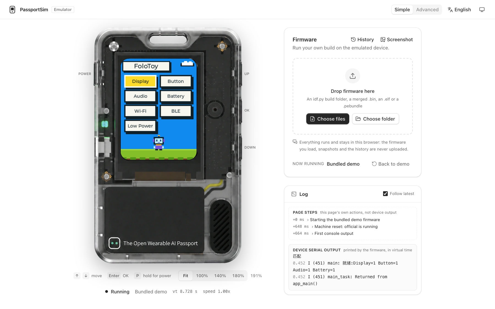
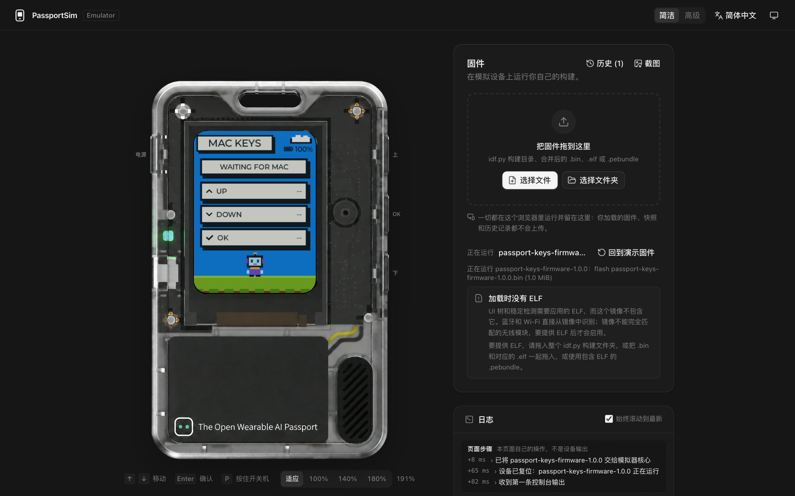
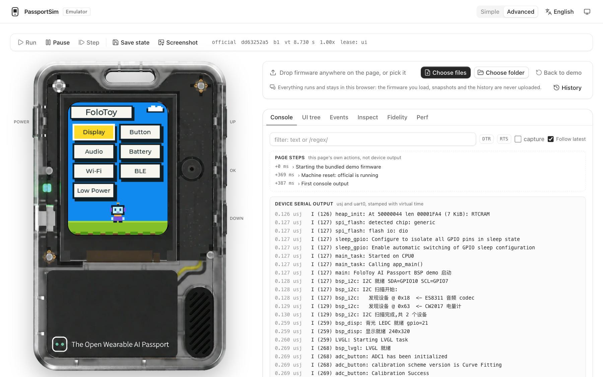
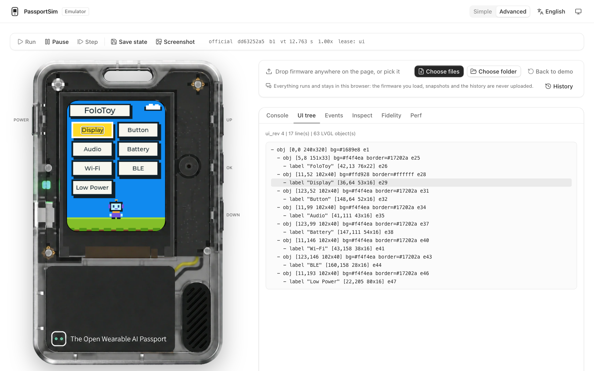

<div align="center">

# PassportSim

**Développez et déboguez le firmware du FoloToy AI Passport sans l'appareil.**<br>
Exécutez un firmware ESP-IDF non modifié dans votre navigateur ou sur votre ordinateur.

**Essayez-le en ligne : [passportsim.bugs.cc](https://passportsim.bugs.cc)**, sans rien installer.

[](../../../LICENSE)


[English](../../../README.md) | [简体中文](../zh-CN/README.md) | [日本語](../ja/README.md) | **Français**



</div>

## Ce que vous pouvez faire

- **Exécuter un firmware sans l'appareil.** Déposez une compilation sur la page : l'écran, les
  boutons, le son et la console série fonctionnent comme sur la carte.
- **Le déboguer.** Pause, pas à pas, sauvegarde et restauration de l'état, console, arbre de
  l'interface, tâches et mémoire.
- **Essayer le firmware des autres.** Un `.bin` fusionné, un dossier de compilation `idf.py` ou un
  `.pebundle` s'exécutent tels quels. Rien n'est envoyé : tout reste dans votre navigateur.
- **L'automatiser.** Une ligne de commande et un serveur MCP pour les scripts, la CI et les agents
  IA.

## Démarrage rapide

Le plus simple est la [version en ligne](https://passportsim.bugs.cc) : ouvrez-la et déposez votre
firmware sur la page.

Installer la ligne de commande depuis la dernière version publiée :

```sh
curl -fsSL https://passportsim.bugs.cc/install.sh | sh      # macOS (Apple silicon)
```

```powershell
irm https://passportsim.bugs.cc/install.ps1 | iex           # Windows x64 (PowerShell)
```

Pour la compiler et l'exécuter depuis les sources, il faut [Rust](https://rustup.rs), [Bun](https://bun.sh) et [just](https://github.com/casey/just)
(ou `make`).

```sh
just setup    # une seule fois
just run      # compile et ouvre l'interface web sur http://127.0.0.1:4173/
```

Autres commandes :

| Commande | Rôle |
|---|---|
| `just cli start --fw official` | Lance la ligne de commande avec des arguments |
| `just test` | Tests unitaires |
| `just package` | Construit un paquet pour cet ordinateur dans `target/package/` |
| `just deploy` | Publie l'interface web sur Cloudflare Workers |
| `just` | Liste toutes les commandes |

Avec `make`, les arguments passent par des variables : `make run PORT=8080`,
`make cli ARGS="start"`.

## Dans le navigateur

- **Le mode simple** s'ouvre en premier : l'appareil, une zone où déposer votre firmware et un
  journal.
- **Le mode avancé** ajoute le contrôle de l'exécution, la console série, l'arbre de l'interface,
  l'enregistrement des événements et des cartes pour la batterie, l'USB, l'audio, le NFC, le Wi-Fi
  et le Bluetooth.

La page existe en français, anglais, chinois et japonais, en thème clair et sombre.

<table>
  <tr>
    <td width="50%"></td>
    <td width="50%"></td>
  </tr>
  <tr>
    <td align="center"><sub>Charger votre propre firmware</sub></td>
    <td align="center"><sub>Le mode avancé et la console série</sub></td>
  </tr>
</table>

## En ligne de commande

```sh
just package
cd target/package/passportsim-*-macos-arm64
./passportsim start                  # démarre la démo
./passportsim start path/to/firmware.bin
./passportsim screenshot             # enregistre l'écran en PNG
./passportsim serial read            # lit la console
./passportsim stop
```

Sous Windows, l'exécutable s'appelle `passportsim.exe`. Le [guide de démarrage](quickstart.md)
décrit le premier lancement sur chaque système.

## Avec des agents IA

`passportsim mcp` est un serveur MCP. Ajoutez-le à votre client MCP :

```json
{ "mcpServers": { "passportsim": { "command": "/path/to/passportsim", "args": ["mcp"] } } }
```

L'agent peut démarrer un firmware, appuyer sur les boutons, attendre une ligne de la console, lire
l'arbre de l'interface et faire des captures d'écran. Ajoutez la
[compétence pour agents](../../../skills/passportsim/SKILL.md) avec
`npx skills add BlackHole1/passportsim`, ou copiez `skills/passportsim/` dans le dossier des
compétences de votre agent.

<div align="center">

<br><sub>L'arbre de l'interface que lit un agent, le widget survolé encadré à l'écran</sub>
</div>

## Systèmes pris en charge

| | |
|---|---|
| macOS sur puce Apple | Pris en charge |
| Windows 10 ou plus récent, x64 | Pris en charge |
| Navigateurs | Chrome, Edge, Firefox et Safari |
| Linux | Non pris en charge |

## En savoir plus

| | |
|---|---|
| [Fonctionnement](overview.md) | Ce qui est émulé, l'architecture, le déterminisme et la fidélité |
| [Démarrage](quickstart.md) | Paquets, premier lancement, démon, bundle web, Windows |
| [Commandes](../../commands/) | Chaque commande, ses arguments et ses erreurs |
| [Déployer sur Cloudflare](deploy-cloudflare.md) | Publier l'interface web comme site statique |
| [Architecture](ARCHITECTURE.md) | La conception complète |

Les références générées (commandes, codes d'erreur, `fidelity.md`, schémas), `THIRD_PARTY.md` et
`LICENSE` n'existent qu'en anglais.

## Contribuer et licence

Les contributions sont les bienvenues : lisez [CONTRIBUTING.md](CONTRIBUTING.md) et le
[code de conduite](CODE_OF_CONDUCT.md). Signalez les problèmes de sécurité comme l'indique
[SECURITY.md](SECURITY.md).

Licence MIT, voir [LICENSE](../../../LICENSE). Les éléments tiers sont listés dans
[THIRD_PARTY.md](../../../THIRD_PARTY.md). FoloToy, AI Passport, Espressif et ESP32 sont des noms
appartenant à leurs propriétaires respectifs.
