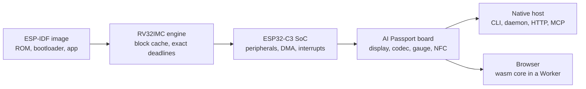

# Comment fonctionne PassportSim

[English](../../overview.md) | [简体中文](../zh-CN/overview.md) | [日本語](../ja/overview.md) | **Français**

Les détails derrière le [README](README.md) : ce qui est émulé, comment, comment la fidélité est
vérifiée et ce qui n'est pas encore possible. La conception est décrite dans
[ARCHITECTURE.md](ARCHITECTURE.md).

## Ce qui est émulé

| | |
|---|---|
| **La carte entière** | ESP32-C3 (RV32IMC) avec ses périphériques, l'écran ST7789 et son rétroéclairage, le codec audio ES8311, la jauge de batterie CW2017, les boutons sur ADC, le NFC et l'USB Serial/JTAG |
| **Le vrai démarrage** | La ROM de la puce s'exécute, puis le bootloader de second niveau, puis votre application, à partir de la même image fusionnée que celle que vous flasheriez |
| **Voir et toucher** | Captures d'écran en trois vues (raw, glass, perceived), appuis sur les boutons, maintien du bouton d'alimentation, branchement et débranchement USB, niveau de batterie et chargeur |
| **Regarder à l'intérieur** | L'arbre des widgets LVGL, les tâches FreeRTOS, le tas, la NVS, et une table de fidélité de ce qui est modélisé exactement et de ce qui est approché |
| **Monde virtuel** | Points d'accès Wi-Fi scriptés, une centrale BLE pour les scans, les connexions et le GATT, une carte NFC avec des enregistrements NDEF, un micro qui joue un son ou un fichier |
| **Maîtrise du temps** | Exécuter jusqu'à une ligne de console ou un événement, avancer instruction par instruction, tourner en temps réel ou aussi vite que possible, enregistrer, restaurer et dupliquer des instantanés |
| **Outils existants** | `esptool` et `idf.py monitor` atteignent la puce émulée par un point d'accès série RFC 2217, comme ils le feraient avec la carte |
| **Scénarios** | Exécutions de tests scriptées avec rapports JUnit, pour la CI ou la note de livraison d'un agent |
| **Appareil réel, en sécurité** | Un flasheur optionnel qui planifie chaque écriture, la répète sur l'émulateur, sauvegarde d'abord toute la flash et ne touche jamais aux zones qui identifient l'appareil |

## Architecture

Les crates du cœur sont du Rust pur qui compile pour les cibles natives et pour
`wasm32-unknown-unknown`, sans accès propre à l'horloge, aux threads, aux fichiers ou au réseau.
Les hôtes les fournissent par des interfaces étroites : les exécutions sont donc déterministes, et
la même machine tourne derrière une ligne de commande, un démon ou une page web.

## Déterminisme

La même image avec les mêmes entrées donne les mêmes instructions, la même console et les mêmes
pixels sous macOS et sous Windows. Chaque exécution de CI, sur l'un ou l'autre hôte, compare un
scénario fixe, instruction par instruction et pixel par pixel, à un golden enregistré sous macOS et
versionné.

## Fidélité

- **Le silicium d'abord.** Le comportement des registres et le timing viennent de la documentation
  publique, des sources d'ESP-IDF sous Apache-2.0 et de firmwares de sonde exécutés sur la vraie
  puce. Chaque ligne de comportement de `specs/` cite sa source et porte une classe de fidélité.
- **Salle blanche.** Aucun code source d'émulateur sous GPL, LGPL ou sans licence n'est lu ni copié ;
  les autres émulateurs ne servent que d'oracles en boîte noire
  ([CONTRIBUTING.md](CONTRIBUTING.md#salle-blanche)).
- **Trois niveaux de tests**, lancés avec `cargo xtask ci t0|t1|t2` (`just ci` lance T0) : tests
  unitaires et d'intégration, images et traces de référence, exécutions dans Chromium, Firefox,
  WebKit et Edge, et seuils de performance par moteur et par hôte.

## La page web

Le cœur est compilé en WebAssembly et tourne dans un Web Worker avec l'écran, le son et la console
série de la carte, en temps réel. La page n'envoie que des requêtes GET pour ses propres fichiers :
firmwares, instantanés, captures d'écran et historique des firmwares restent dans le navigateur.
Elle peut être servie par `passportsim serve`, par `just run` ou comme site statique
([deploy-cloudflare.md](deploy-cloudflare.md)).

## Limites connues

- **La radio exige ESP-IDF v5.5.3.** Le Bluetooth et le Wi-Fi ne se branchent qu'aux firmwares
  compilés avec IDF v5.5.3. Les autres versions tournent jusqu'à leur premier accès à la radio, puis
  s'arrêtent avec une erreur nommée. Sans l'ELF de l'application, une radio ne se branche que si
  toutes les fonctions qu'elle intercepte sont trouvées dans l'image.
- **Le monde radio est virtuel.** Le Bluetooth dialogue avec une centrale virtuelle intégrée, jamais
  avec un vrai téléphone ; l'appairage, l'advertising étendu et un firmware jouant le rôle de
  centrale ne sont pas pris en charge. Le Wi-Fi rejoint en station des points d'accès scriptés,
  ouverts ou WPA2-PSK, sans internet ; le SoftAP n'est pas pris en charge. Un pont de ports vers des
  services de votre ordinateur ne fonctionne qu'avec le démon natif.
- **La batterie ne se charge ni ne se décharge d'elle-même.** Son niveau ne change que lorsque vous
  le réglez.
- **Le timing est approché par défaut.** Le profil `fast` par défaut termine les opérations
  matérielles instantanément. Le profil calibré `device` (`--profile device` en ligne de commande,
  absent de la page web) est proche de la carte, sans être exact au cycle près.
- **Les instantanés web restent dans la page.** Les instantanés et l'historique de retour arrière
  (20 points, un toutes les 2 secondes) vivent dans la mémoire de la page et ne peuvent pas être
  exportés ; la ligne de commande dispose de `snapshot export`.
- **Certains blocs ne font que stocker ce qu'on y écrit.** RMT, TWAI, UHCI, HMAC, le bloc de
  signature numérique, le GPIO dédié, le world controller et XTS-AES n'ont pas de comportement, donc
  le chiffrement de la flash ne fonctionne pas. La mise en veille ne se réveille que sur le timer ou
  un niveau de GPIO.
- **L'audio diffère dans les détails.** Le gain micro du codec n'est pas appliqué, la référence
  d'annulation d'écho lit du silence, et la ligne de commande enregistre le son en fichiers WAV au
  lieu de le jouer.
- **Pas de port série.** Les outils série se connectent en TCP (`rfc2217://` ou `socket://`) ; un
  pty n'est disponible que sous macOS.
- **Flasher un appareil réel** demande la ligne de commande compilée depuis les sources avec la
  fonctionnalité `device` ; la page web ne flashe jamais d'appareil.
- **Hôtes.** macOS sur puce Apple et Windows 10 ou plus récent sur x64. Linux et les Mac Intel
  n'ont pas de build.
