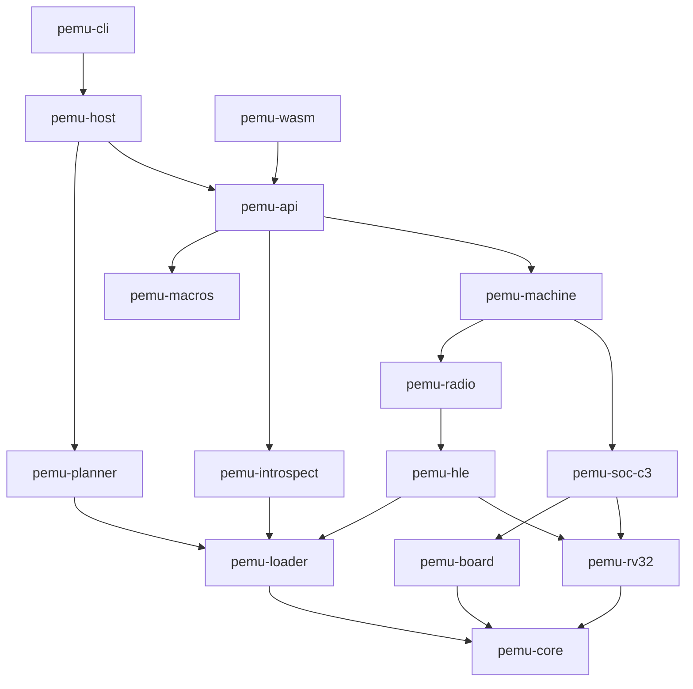
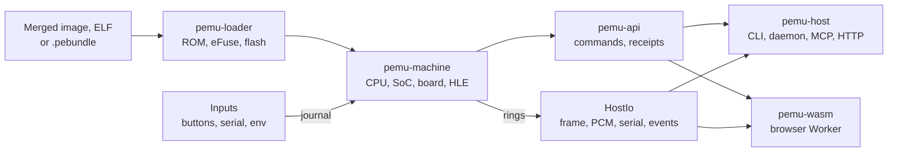

# アーキテクチャ

[English](../../ARCHITECTURE.md) | [简体中文](../zh-CN/ARCHITECTURE.md) | **日本語** | [Français](../fr/ARCHITECTURE.md)

PassportSim は FoloToy AI Passport をエミュレートします。これは ESP32-C3(rev v1.1、RV32IMC)に ST7789 ディスプレイ、ES8311 オーディオコーデック、CW2017 バッテリーゲージ、ADC ボタン、NFC カード、USB Serial/JTAG を載せたボードです。実機と同じマージ済みフラッシュイメージを、チップの本物のマスク ROM から実行し、同じコアをネイティブでもブラウザでも動かします。

このドキュメントは現在の設計と、今も設計を制約している理由を説明します。一次情報はコードです。このドキュメントとコードが食い違う場合はコードが正しく、このドキュメントを修正します。

## 目標と原則

- **実機と同じイメージ。** 本物の rev v1.1 ROM を改変せずに実行し、続いて 2 段目のブートローダーとアプリケーションを実行します。ファームウェアには一切パッチを当てません。
- **1 つのコア、多くの入口。** 1 組のクレートがネイティブと `wasm32-unknown-unknown` の両方でビルドされます。CLI、MCP サーバー、HTTP と WebSocket の API、シナリオ、ブラウザのページ、生成ドキュメント、エージェント用スキルは、すべて 1 つのコマンドレジストリから生成されます。
- **コア内の時間は仮想時間だけ。** ゲストはホストの時刻を見ないため、実行は入力だけで決まる純粋な関数になります。
- **安全側に止め、失敗には名前を付ける。** モデル化されていないレジスタ、無線の結び付けの不一致、抜け出せないポーリングループ、起こされることのない待機は、推測で進めず名前付きのエラーで実行を止めます。
- **忠実度は暗黙にせず報告する。** すべての応答にレシートが付き、何を正確にモデル化し、何を近似し、何に触れたがモデル化していないかを示します。
- **秘密情報は既定で外に出さない。** デバイスの識別情報、キャリブレーションデータ、カードの内容は、リポジトリ、ログ、エクスポート、エージェントに見える出力に入りません([secrets.md](secrets.md))。
- **小さなファイルに 1 人の持ち主。** ペリフェラル、ボードチップ、コマンドごとに 1 ファイルとし、レジストリには各エントリが自分のファイルから参加するため、並行した変更はほとんど衝突しません。

対象外：キャリブレーション済みの `device` プロファイルを超えるサイクル精度のパイプラインタイミング、無線の RF、PHY、MAC レジスタのエミュレーションやクローズドな無線ライブラリの実行、ホストのシリアルデバイスとして見せること(シリアルツールは TCP で接続します)、Linux と Intel Mac のホスト、GDB リモートスタブ。

## リポジトリの構成

| パス | 内容 |
|---|---|
| `crates/` | Rust のワークスペース(次の節) |
| `web/` | ブラウザのページ。TypeScript と React で、Bun でビルドとテストを行い、Playwright のエンドツーエンドテストを持つ |
| `specs/` | 行ごとに出典を持つ動作データ。レジスタの CSV、ブロックごとの TOML、タイミングプロファイル、HLE の結び付けプロファイル、メモ |
| `boards/ai-passport.toml` | ボードの記述。クロック、フラッシュの型番、ストラップ、ピン、バッテリーと電源のパラメーター |
| `assets/rom/` | Espressif の ROM ELF(Apache-2.0)。バイナリに埋め込まれ、ピンとライセンスを同梱 |
| `probes/` | 実チップで動作を測定する ESP-IDF のプローブファームウェア。ビルド済みの ELF もコミット済み |
| `tests/` | ワークスペースのテスト(`tests/milestones/`)、ゴールデン、シナリオ、トランスクリプト、フィクスチャ |
| `tools/oracle/` | Espressif QEMU をブラックボックスのオラクルとして動かすスクリプト(macOS のみ) |
| `skills/passportsim/` | すべてのパッケージに同梱されるエージェント用スキル |
| `xtask/` | 開発用タスク。コード生成、チェック、CI ティア、ベンチマーク、パッケージ作成 |
| `docs/` | このドキュメント、概要、クイックスタート、シークレットポリシー、生成されたコマンドリファレンス、`docs/i18n/` の翻訳 |

## クレート

| クレート | 役割 |
|---|---|
| `pemu-core` | 仮想時間、クロック、スケジューラー、決定的な乱数、入力ジャーナル、レジスタの保存領域、ホスト I/O リング、スナップショットのコーデック、トレースレコード、共通の AES |
| `pemu-rv32` | デコーダー、命令、CSR、トラップ、PMP、ブロックキャッシュのエンジン、参照用のシングルステップインタープリター、コストモデル、`Bus` トレイト |
| `pemu-soc-c3` | メモリアリーナ、ページテーブル、MMU とキャッシュ、フラッシュストア、MMIO マップ、割り込みマトリクス、DMA ビュー、ペリフェラルごとと、ブロック間の配線効果ごとに 1 ファイル、生成されたレジスタテーブル |
| `pemu-board` | ボードチップのトレイトと Passport のチップ群。パネル、バックライト、コーデック、ゲージ、バッテリー、ボタンのラダー、電源レール、USB の差し込み、NFC タグ |
| `pemu-loader` | ELF とシンボル、ESP イメージとアプリ記述子、パーティションテーブル、同梱の ROM とそのピン、eFuse の合成と取り込み、`.pebundle` |
| `pemu-hle` | ハイレベルエミュレーション。フックセット、マジックリターン PC、結び付け、入れ子のゲスト呼び出し、継続、トリップワイヤー、イメージからのシンボル復元 |
| `pemu-radio` | VHCI 上の BLE コントローラー、仮想の電波空間とセントラル、Wi-Fi ドライバーのモデル、仮想 LAN(smoltcp)、ヒープの台帳 |
| `pemu-machine` | 組み立て、実行ループ、停止、ポーリングと ROM 遅延の早送り、ハングとデッドロックの検出、スリープ、スナップショット、フォーク、状態ハッシュ |
| `pemu-introspect` | DWARF のレイアウト、アンワインド、FreeRTOS、ヒープ、LVGL の走査、パニックの解読、秘匿済みの NVS 一覧 |
| `pemu-api` | コマンドレジストリとコマンド、セッションプール、出力の整形、秘匿処理、マッチャー、レシート、シナリオ、クロックのリース、ホストとの継ぎ目 |
| `pemu-macros` | `#[command]` による登録 |
| `pemu-planner` | 純粋なフラッシュ計画のビルダーと拒否ルール。実機での実行はフィーチャー `device` の裏にある |
| `pemu-host` | ネイティブホスト。デーモンとプール、ホストのディレクトリ、プラットフォームのサービス、MCP、HTTP と WebSocket、USB Serial/JTAG のエンドポイント、リレー、成果物、ブートキャッシュ |
| `pemu-cli` | `passportsim` バイナリ |
| `pemu-wasm` | ブラウザの Worker が呼ぶ素の C ABI と、TypeScript と共有するリングのレイアウト |
| `pemu-testkit`、`pemu-verify` | テストの支援。コーパスの探索、レジスタのハーネス、モックのボードとマシン、ゴールデンの実行、コンソールの正規化、許容幅、トレースとオラクルの比較、キャリブレーションのフィット |
| `tests/milestones`(`pemu-milestones`) | 実イメージをブートする結合テスト。1 ファイルが 1 テストターゲット |

### レイヤー



矢印は推移的で、クレートは到達できるものすべてに依存できます。`cargo xtask layering` が次のルールをチェックします。

1. **コアクレートは wasm 向けにビルドでき、ホストに触れません。** `pemu-host`、`pemu-cli`、テスト用クレート、`xtask`、フィーチャー `device` 付きの `pemu-planner` を除くすべてのクレートは `wasm32-unknown-unknown` 向けにビルドでき、`std::time`、`std::thread`、`std::fs`、`std::env`、`std::net`、`std::process`、プラットフォームの数学関数、状態に影響するハッシュマップの反復を使いません。
2. **ペリフェラルは他のペリフェラルを名指ししません。** ブロック間の効果(DMA、クロックの変更、割り込み、リセット)は、マシンが適用する `Wiring` のバリアントを通します。
3. **ボードチップは SoC のレジスタを読まず**、SoC が名指しするのはボードのトレイトだけです。
4. **HLE と無線のコードがホストに到達するのは、`HostIo` のリングとジャーナル化された入力を通じてだけです。**
5. **シリアルデバイスを開くのは、フィーチャー `device` 付きの `pemu-planner` だけです。** それ以外の場所では、`pemu_host::paths::refuse_device` がデバイスパス(`/dev/cu.*`、`COM<n>`、`\\.\` 名前空間)を開く前に拒否します。
6. **ホスト固有のコードは `pemu_host::platform` に**、ディレクトリの役割は `pemu_host::paths` に置きます。他のクレートは `cfg(target_os)` を持ちません。
7. **サードパーティのライセンス**は `deny.toml` の寛容なライセンスに限られ、GPL、LGPL、AGPL、ライセンス不明のクレートは拒否されます。

## データの流れ



- **読み込み。** ローダーは eFuse のチップリビジョンが選ぶ同梱 ELF から ROM イメージを作り、SHA-256 のピンを確認し、ダンプが与えられなければ既定の eFuse(プレースホルダーの MAC と、ADC キャリブレーションが初期化できるブロックリビジョン)を合成し、フラッシュイメージをマップします。上書き(`--rom`、`PASSPORTSIM_ROM`、設定)はネイティブのみです。
- **入力**(ボタン、シリアルのバイト、USB の回線状態、マイクのチャンク、ネットワークのフレーム、HCI パケット)には仮想時刻が刻印され、ジャーナルに追記されます。モデルはジャーナル化された入力だけを使うため、セッションとそのリプレイは同じバイトを同じ時点で受け取ります。追記箇所は `Machine::input_from` の 1 か所だけで、各入力は由来(エンドポイント、UI、ブリッジ)を記録します。
- **出力**はコアのメモリ内にある固定容量のリングを通って出ていきます。フレームバッファ、音声出力、2 つのコンソール、イベントです。wasm ではリングが線形メモリにあり、Worker が型付きビューで読むため、バイトやピクセルごとに JavaScript の境界を越えることはありません。
- **コマンド**が唯一の制御経路です。UI、CLI、エージェントがすべて同じレジストリを呼ぶため、UI のセッションのジャーナルはエージェントのものと同じになります。

## コアの抽象

- **エンジン。** ブロックは制御フロー命令と CSR 命令、64 命令、または 4 KB のページ境界で終わり、命令の種類に対する `match` でディスパッチされます。トラップは正確で、命令数の予算は厳密に守られ、割り込みは `run` の呼び出しの間でのみ受け付け、ブロックの境界は外から観測できません。そのためブロックキャッシュは派生状態であり、スナップショットには含めません。エンジンと `ref_step` はブロックサイズ 1、3、64 で互いにファズテストされます。
- **メモリ。** 1 つのアリーナが ROM、SRAM、RTC RAM、8 MB のフラッシュを保持します。ページテーブルで高速なロードとストアを行い、MMIO、コールドページ、権限が分かれたページは低速経路を通ります。アクセスはサイズとバイトオフセットを保ち、狭い書き込みを読み出し・変更・書き込みに広げることはありません。
- **ペリフェラル。** `periph/mod.rs` には 1 つの `c3_devices!` テーブル(名前、ベースアドレス、サイズ、モデル)があり、そこから MMIO マップ、スナップショットのセクション、リセットの伝播が生成されます。まだモデルのないブロックは `StoreOnly` で、読み出しは保存値を返し、書き込みは保存され、各レジスタへの最初のアクセスが忠実度の台帳に記録されます。
- **ボード。** チップは `BoardPorts` の裏で `I2cDevice`、`SpiDevice`、`I2sCodec` などを実装します。値は `boards/ai-passport.toml` から取り、出典は `specs/` にあります。
- **HLE。** フックされた関数はエンジンのフック終端になります。ハンドラーはシリアライズ可能な状態機械で、ROM の未使用領域にあるマジックリターン PC を通じてゲストを呼び返すことができ、スタックオーバーフローや削除済みタスクの再開を防ぐガードを持ちます。
- **マシンのファサード。** `MachineApi`(run、input、io、now、ゲストメモリ、レシート、汚染)はオブジェクトセーフです。`SnapshotMachine` はスナップショット、復元、フォーク、秘匿、`state_hash` を加えます。停止条件は、ブレークポイント、ウォッチ、マッチャーからなる 1 つの `StopSet` です。
- **スナップショット。** すべてのセクションはバージョンとゴールデンバイトのテストを持ち、セクションのレイアウトが変わると `pemu-core/src/snap.rs` の `FORMAT_VERSION` を上げます。派生状態(ブロックキャッシュ、ページテーブル、フック)は保存せず再構築します。別の実行アイデンティティのスナップショットは `SnapError::IdentityMismatch` で拒否します。ライブブリッジの接続中は、ホスト側の相手がスナップショットに含まれないため、復元と巻き戻しを拒否し、フォークには明示的なポリシーが必要です。
- **コマンド。** コマンドは `pemu-api/src/commands/` の 1 ファイルで、引数と出力の型、ハンドラー、テキストのレンダラー、例を持ちます。ネイティブビルドでは `linkme` で、wasm では `pemu-wasm/build.rs` が生成するリストで登録されます。エラーコードは caps グループごとの範囲にまとめられ(コアは 1000 未満、audio 1000、radio 2000、NFC 3000、debug 4000、device 5000、power 6000)、一度出荷したコードは名前と番号を変えません。

### 凍結されたインターフェース

次の型は多くのファイルで共有され、意図的にしか変更しません：`Bus`、`Op`、`Peripheral`、`Cx`、`Wiring`、`RegStore`、`HostIo`、スナップショットのコーデックと `snap_struct!`、ボードチップのトレイト、`GuestView`、`MachineApi`、`SnapshotMachine`、停止条件の型、`CommandSpec`、`Output`、`ApiError`、レシート、そして `pemu_wasm::layout` を含む wasm ABI。拡張ポイントの `RadioModule`、`IdlePolicy`、`OpFuser`、`ExecTier` は、それぞれ常に正しい答えになる何もしない既定実装を持ちます。

凍結されたインターフェースの変更は、それを使うコードより先に、単独のプルリクエストで行います。説明に理由を書き、同じ変更でこのドキュメントも更新します。既定の本体を持つメソッドの追加や、範囲内でのエラーコードの追加には、別の変更は必要ありません。`ABI_VERSION` は wasm の関数やレイアウトが変わるたびに、`FORMAT_VERSION` はスナップショットのレイアウトが変わるたびに上げます。

## 実行と時間

実行ループは、期限の来たジャーナル入力を適用し、期限の来たイベントを処理し、停止条件を確認し、WFI と割り込みを扱い、次のイベントまたは上限で終わる予算でエンジンを動かします。期限を変えるアクセスはすべて `OkStop` を返すため、イベントが遅れて発火することはありません。実時間に合わせたペース配分は `run` の外にあり、ホストが仮想時間の上限を渡して、呼び出しの間に実時間を確認します。

- **仮想時間**はクロックの位置、つまりリタイアした命令数と命令の種類ごとの追加サイクルで進みます。カウンター(SYSTIMER、TIMG、RTC、ウォッチドッグ)は読み出し時に仮想時間から計算され、アラームはイベントとしてスケジュールされます。何も刻みません。
- **WFI とライトスリープ**は次のイベントまで跳びます。ディープスリープは CPU をリセットし、RTC ドメインを保持します。CPU はリセット解除時に水晶周波数の半分で動きます。
- **タイミングプロファイル**は `specs/timing-profiles.toml` のデータで、実行アイデンティティの一部です。`fast`(既定)はデバイスの操作を即座に完了させ、1 命令 1 サイクルで数えます。`device` は実チップのプローブキャプチャに合わせてキャリブレーションされています。命令の種類ごとのコスト(分岐成立、ジャンプ、ロード直後の使用、除算、MMIO のバスサイクル)、ストリーミングフィルと先読みを持つ 16 KB 8 ウェイ FIFO のフラッシュキャッシュ、SRAM のバンク競合、フラッシュ、SPI、I2C、SHA、ADC、USB 送出のバス時間を含みます。許容幅の範囲で正確ですが、サイクル単位では正確ではありません。
- **ポーリングの早送り。** MMIO のポーリングループがアーキテクチャ上同じ状態(同じ PC、アドレス、値、レジスタで、間にストア、イベント、フック、時刻の読み出しがない)で繰り返されると、マシンは値を変えうる次のイベントまで反復をまとめて飛ばします。既定で有効で、結果は変わりません。正規化されたトレースは、どちらの場合もポーリングを連続として記録します。
- **ROM 遅延の早送り。** ROM の `ets_delay_us` ループを反復単位で飛ばし、サイクルカウンターとすべてのレジスタを実際に実行した場合と同じに保ちます。このフックは ROM の SHA-256 に結び付いています。
- **ハングとデッドロックの検出。** 何も変えられないレジスタのポーリングや、仮想時間で `stuck_ms` より長く変化しないポーリングは、ビジーウェイトの行を示して `E_STUCK` で停止します。ルーティングされた割り込みも保留中のイベントも起こせない WFI 中のハート、または互いのミューテックスを待つ FreeRTOS タスクの循環は、待機が解けなくなった時点で `E_DEADLOCK` で停止します。`Deadlock` はゲストが入力を待っていることを意味します。
- **ペース配分**は、エージェントの呼び出しの間は `Paused`、エージェント、シナリオ、CI では `Max`、対話的な利用では `Wall`、ブラウザが音を鳴らしている間は `Audio` です。250 ms 以上遅れると基準を取り直し、ゲストはスローモーションで動き、仮想時間が跳ぶことはありません。クロックのリースを持てるのは一度に 1 者(エージェント、UI、エンドポイント、シナリオ)だけです。ライブブリッジ(実ネットワーク、外部 HCI、ライブのマイク)は、相手がホストの時間で応答するため、ペースを実時間に固定します。

## 決定性

- **実行アイデンティティ**は、ROM、フラッシュイメージ、アプリの ELF、eFuse のハッシュ、`MachineConfig` のハッシュ(ボード、プロファイル、シード、スクリプト化された世界、ハングの設定)、そして入力ジャーナルです。テキストの入力はファイルのバイトではなく解析後の構造でハッシュするため、改行コードやキーの順序はアイデンティティを変えません。
- **アイデンティティが同じなら出力はビット単位で同一です：** コンソールのバイト、正規化された MMIO と割り込みのトレース、フレーム、PCM、`state_hash`。
- **結果は次のものに依存しません：** ホスト(macOS、Windows、Node、Chrome、Edge、Firefox、Safari)、ビルドプロファイル、ブロックサイズ、スライスサイズ、早送り、トレース、ペース配分、一時停止やスナップショットを取る位置。
- **状態に関わる経路で禁止されているもの：** ホストの時計、ホストの乱数、ハッシュマップの反復、スレッド、浮動小数点の NaN ペイロード、そしてホストによって最下位ビットが異なるプラットフォームの数学ライブラリ(`clippy.toml` で禁止。浮動小数点が必要な箇所では移植可能な `libm` クレートを使います)。ゲストのエントロピーはシード付きの `DetRng` から得ます。
- **非決定的な入力源はジャーナル化されます。** レシートは `deterministic`、`replayable`、`live` のいずれかを示します。
- **ホスト間の一致。** `tests/milestones/cross_host/` は同梱の ROM 上で合成イメージを両方のプロファイルでブートし、スナップショットのバイトを含むすべてのダイジェストを、macOS で記録してコミットしたゴールデン `tests/golden/cross-host/parity.txt` と比較します。すべてのホストが T0 でこれを確認します。

## 無線

BLE と Wi-Fi はドライバーの境界でエミュレートし、それより上はすべて本物のゲストコードとして動きます。

| 無線 | 置き換えるもの | 本物のまま動くもの |
|---|---|---|
| BLE | `bt.c` の 7 つの VHCI コントローラー関数 | NimBLE ホスト、GATT、SMP、アプリケーション |
| Wi-Fi | `esp_wifi_init`/`deinit`、公開された `esp_wifi_*` API、データプレーンのフック | lwIP、esp_netif、DHCP、mbedTLS、HTTP クライアント |

- **結び付けは完全一致か、何もしないか。** フックするすべての関数が `specs/hle/idf-5.5.3/` のプロファイルとサイズおよび再配置をマスクしたコードハッシュで一致し、アプリの IDF バージョンも一致するときだけ、モジュールが結び付きます。一致しなければ、その無線は `unsupported image` となり、それ以外は動き続けます。
- **ELF がない場合**は、関数本体全体のコードの形からイメージ内のシンボルを復元します。モジュールが結び付くのは、すべての名前がちょうど 1 回ずつ見つかった場合だけです。ELF のない Wi-Fi はこの方法でしか結び付きません。
- **トリップワイヤー**をクローズドライブラリの内部に置き、そこに到達した実行を、分かりにくいアサートではなく `E_TRIPWIRE` で止めます。
- **世界はスクリプトで定義します。** 仮想の BLE セントラルがスキャン、接続、GATT を行い、Wi-Fi は仮想 LAN 上のスクリプト化されたオープンまたは WPA2-PSK のアクセスポイントに接続します。許可リスト方式のポートブリッジと外部の HCI の相手が、ネイティブホストから現実世界につながります。どちらもライブブリッジです。

## ホスト側の入口

- **生成される入口。** CLI(`passportsim <cmd>`)、MCP ツール(`passport_<cmd>`)、HTTP(`POST /v1/instances/{id}/commands/{name}`)、WebSocket、シナリオのステップ、TypeScript の型、コマンドリファレンス、スキルは、すべてレジストリから生成されます。コマンドの例は argv の配列として保存され、CI でシェルを介さずに実行されます。既定の MCP ツール一覧は JSON で 24 KB までに抑えられ、audio、radio、NFC、power、debug、device のグループは `--caps` で追加します。
- **ホストごとの対応状況**は `pemu_api::host_support::TABLE` の 1 つの表にあります。ホストで実行できないコマンドは代替手段を示して `E_HOST_UNSUPPORTED` で失敗し、生成ドキュメントは完全な対応表を示すため、どのホストでも同一になります。
- **ホストとの継ぎ目。** `pemu-api` はコアクレートなので、成果物、シナリオファイル、マシンのファクトリー、時計、エンドポイントには、ホストが起動時に埋める継ぎ目(`pemu_host::backend::install`、`hooks::install`)を通じて到達します。埋められていない継ぎ目は、そのインストーラーを示す実行時の拒否になります。
- **出力はトークン効率を重視します。** シリアルの読み出しはカーソルに基づく差分、UI ツリーは刈り込んだテキスト形式と差分、大きなデータはパスとハッシュで返す成果物ファイルになります。成果物のパスは成果物ルートからの相対パスでスラッシュ区切りです。ルート自体を報告するのは `status` だけです。
- **デーモン。** `passportsim start` は、デーモンが動いていなければ `passportsim serve --headless` を切り離して起動するため、エージェントの呼び出しは起動をまたいでインスタンスを共有します。検出には、ポートとベアラートークンを書いたランタイムディレクトリのファイルを使い、古くなったかどうかはプロセス ID ではなく接続して判定します。デーモンは 10 分間アイドルが続くと終了します。各インスタンスは 8 MiB のスタックを持つ専用スレッドで動きます。
- **サーバー。** HTTP、WebSocket、MCP の streamable HTTP、静的 UI は 1 つのループバックのリスナーを共有します。ベアラートークンかセッションクッキーが必要で、`Host` と `Origin` を確認し、COOP/COEP ヘッダーを送ります。CLI は URL フラグメントに 1 回限りの起動コードを付けて UI を開き、そのコードは `HttpOnly`、`SameSite=Strict` のクッキーと交換されます。
- **USB Serial/JTAG のエンドポイント。** TCP エンドポイントは最初のバイトから RFC 2217、生の esptool SLIP、素のコンソールを判別します。書き込みには `rfc2217://127.0.0.1:<port>` を使います(esptool は `socket://` 越しにはリセットのシーケンスを実行できません)。モニターはどちらでも使えます。pty のエンドポイントは macOS にのみあります。
- **ホストのディレクトリ**(設定、データルート、キャッシュ、ランタイム、ログ、成果物)は `pemu_host::paths::HostPaths` だけが解決します。macOS では `~/.config/passportsim` と `~/Library/Application Support/passportsim`、Windows では既知のフォルダー(環境変数は使いません)です。`PASSPORTSIM_HOME`、`PASSPORTSIM_CONFIG_DIR`、`PASSPORTSIM_DATA_ROOT` で上書きでき、シークレットガードはこの上書きを無視します。非公開のファイルは作成時から所有者のみがアクセスできます。
- **外部ツール**(esptool、IDF のツールチェーン)は明示的なフラグと IDF の環境から解決し、`PATH` は使わず、`.bat`、`.cmd`、`.ps1` のシムを通して実行することもありません。

### 実機への書き込み

実機への書き込みはネイティブの CLI 専用で、フィーチャー `device` 付きのビルドを macOS か Windows で使います。計画が正しいと確かめられるまでデバイスに何も触れないよう、手順は決まった順で進みます。検出(ポートを開かずに VID/PID で列挙)、計画(純粋でオフライン)、リハーサル(同じ esptool の呼び出しを、本物のパーティション構成を持つエミュレーターに対して実行)、確認、識別、`cardid` 領域の保護、書き込むすべてのセクターのバックアップ、書き込み、検証、ブートの確認です。プランナーは `nvs`、`phy_init`、`cardid` を書かず、チップ全体を消去せず、eFuse を書きません。`cardid` のダイジェストが変わった場合は `E_CARDID_CHANGED` で停止します。

## Web ページ

```text
Main thread (React)          Emulator Worker (wasm core)           AudioWorklet
 device, panels, input  -->   input: SAB ring or postMessage        playback ring -> output
 console, log           <--   pacing loop, slices of about 8 ms     microphone -> ring
                              OffscreenCanvas WebGL frame
```

- **ランタイム。** コアは専用の Worker 内でシングルスレッドで動きます。ページがクロスオリジン分離されている場合は JavaScript の各部の間で SharedArrayBuffer のリングを使い、そうでなければ `postMessage` にフォールバックします。どのエンジンでもタイマーの精度が粗いため、Worker は `Atomics.wait` で待ち、`Atomics.waitAsync`(ない場合は MessageChannel)で制御を譲ります。
- **UI。** React に、取り込み済みの coss ui コンポーネント(MIT)と Tailwind を組み合わせ、CDN は使わず、ビルドはフラットです(`index.html`、`styles.css`、`main.js`、`worker.js`、`worklet.js`)。シンプルモードはデバイス、ファームウェアカード、ログを表示し、アドバンスモードは実行制御、コンソール、UI ツリー、イベント、インスペクト、忠実度、環境のカードを加えます。英語、簡体字中国語、日本語、フランス語に対応し、初回訪問時はシステムのロケールに従います。
- **デバイスの表示**には FoloToy による AI Passport の正面の製品写真(`THIRD_PARTY.md` を参照)を使い、写真の画面部分にエミュレートした画面を重ね、側面のボタンを操作部にしています(形状は `web/src/app/skinGeometry.ts` にあります)。ズームは、60 x 95 mm の本体に対してフィット、100、140、180 % です。フィットは、列の幅が十分ある間は 140 % を下回らないため、ファームウェアの文字が読める大きさに保たれます。スクリーンショットを実機の写真と取り違えないよう、画面には常に `Emulator` のバッジが表示されます。ボタンは、ゲスト時間で少なくとも 80 ms 保持した押下と解放のエッジを送ります。
- **すべての操作はレジストリのコマンドを呼びます。** ログに記録された各操作は、CLI のコマンドやシナリオのステップとしてコピーできます。
- **ブラウザの外には何も出ません。** ページは自分自身のファイルに対する GET リクエストだけを行います。ファームウェア、スナップショット、スクリーンショット、ファームウェアの履歴(IndexedDB、最大 12 件または 160 MiB)はローカルに残ります。
- **停止には必ず理由を示します。** パニック、トリップワイヤー、停止、解けない待機は理由を表示し、再起動か続行を提示します。停止中は入力を無効にします。
- **読み込み。** 入力がなければ、ページは同梱のデモをブートします。`idf.py` のビルドフォルダ、マージ済みの bin、ELF、`.pebundle` をドロップすると置き換わります。

## パッケージ

`cargo xtask package --target <triple>` は、ホストごとに自己完結した 1 つのバイナリを作ります：`passportsim-<version>-macos-arm64.tar.gz` と `passportsim-<version>-windows-x64.zip`。バイナリには、Web ページ、同じコミットの wasm コア、スキーマ、スキル、同梱の ROM、ビルド済みのデモが埋め込まれます。埋め込まれたペイロードはホスト間でバイト単位で同一で、そのハッシュはパッケージのレシートにあります。Windows のビルドは CRT を静的リンクし、長いパスへの対応と UTF-8 コードページを宣言するマニフェストを埋め込みます。バイナリが Visual C++ ランタイムをインポートしているとパッケージのチェックが失敗します。同じコマンドで静的な Web バンドルと、そのための Cloudflare Workers プロジェクトも書き出します([deploy-cloudflare.md](deploy-cloudflare.md))。

## セキュリティ

ポリシーの全文は [secrets.md](secrets.md) にあります。要点は、MAC アドレス、固有 ID、キャリブレーションワード、バックアップのファイル名、カードの内容を、リポジトリにもエージェントに見える出力にも入れないことです。例には `02:00:00` の MAC プレフィックスを使います。1 つのビルダー `pemu_api::secret_set` が、秘匿処理と `cargo xtask secrets-check` の両方に使われ、git のフックがすべてのコミットとプッシュでこれを実行します。実機の eFuse ダンプから作ったマシンは汚染済みとして扱われ、エクスポートは秘匿され、ブートキャッシュはメモリ内にとどまります。

## 検証

| 層 | 内容 | 場所 |
|---|---|---|
| ユニットテストとモデルのテスト | 生成されたレジスタのテスト、ペリフェラルのハーネス、データシートのシーケンスに対するボードチップ、I2C のトランスクリプト | 各クレート |
| CPU の適合性 | riscv-tests、ESP の CSR テスト、ROM とコーパスの全命令の objdump によるデコード、`ref_step` に対するエンジンのファズ | `pemu-rv32`、`xtask riscv-tests` |
| ゴールデンのブートとシナリオ | 実機の行と許容幅に対するコンソールのテキスト、PNG のゴールデンに対するフレーム、スクリプト化されたシナリオ | `tests/milestones`、`tests/golden`、`tests/scenarios` |
| 決定性 | 2 回の実行、ブロックとスライスのサイズ、早送りの有無、停止位置の不変性、任意の位置でのスナップショット、復元の等価性、ネイティブと wasm の比較、ホスト間の一致 | `pemu-machine`、`xtask ci` |
| オラクルとの比較 | ブラックボックスとして動かした Espressif QEMU に対する書き込み列と呼び出しトレース | `pemu-verify`、`xtask oracle`(macOS) |
| ブラウザ | macOS では Chromium、Firefox、WebKit、Windows では Chromium、Chrome、Edge、Firefox での Playwright | `web/tests` |
| 性能 | 10 % の劣化で止めるワークロードのベンチマーク、ブラウザの CPU 使用率 | `xtask bench`、`xtask bench-browser` |

- **仕様テーブル。** `specs/c3-registers.csv` と `specs/blocks/<block>.toml`(リセットドメイン、ビジーウェイトの行、上書き)は、`cargo xtask codegen` によって生成されるレジスタテーブルと `docs/fidelity.md` にまとめられます。すべての行が出典を記し、`cargo xtask provenance` が出典とクリーンルームのルール([CONTRIBUTING.md](CONTRIBUTING.md))をチェックします。
- **忠実度クラス。** A：実機と一致(キャプチャに結び付いたテストあり)。B：仕様と、オラクルまたは IDF 由来のテストに一致。C：宣言された近似。U：未モデル化。クラスは、それを証明するテストとともにしか上がりません。
- **プローブファームウェア**は `probes/` にあり、シリコンの動作(タイミング、リセット、クロック、割り込み、無線)を測定し、モデルのフィットと確認に使う機械可読の行を出力します。
- **CI ティア。** `cargo xtask ci t0` はコーパスもデバイスデータも必要とせず、すべてのホストで動きます。`t1` はファームウェアコーパス、ゴールデン、ブラウザでの実行を、`t2` は長時間の決定性の実行、オラクルとの比較、ベンチマークを加えます。テストは名前でティアに加わります。`t1_*` と `t2_*` のテストはそれぞれのティアで実行され、T0 はワークスペース全体を実行します。各実行は JSON のレシートを書き出します。
