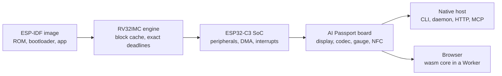

# PassportSim の仕組み

[English](../../overview.md) | [简体中文](../zh-CN/overview.md) | **日本語** | [Français](../fr/overview.md)

[README](README.md) の詳細として、何をどのようにエミュレートしているか、忠実度をどう確認しているか、まだできないことは何かを説明します。設計は [ARCHITECTURE.md](ARCHITECTURE.md) にあります。

## エミュレートの対象

| | |
|---|---|
| **ボード全体** | ESP32-C3(RV32IMC)とそのペリフェラル、ST7789 ディスプレイとバックライト、ES8311 オーディオコーデック、CW2017 バッテリーゲージ、ADC ボタン、NFC、USB Serial/JTAG |
| **実際のブート経路** | チップの ROM、2 段目のブートローダー、アプリケーションの順に、実機に書き込むのと同じマージ済みイメージから実行 |
| **見る・触る** | 3 種類のビュー(raw、glass、perceived)のスクリーンショット、ボタン操作、電源ボタンの長押し、USB の抜き差し、バッテリー残量と充電器 |
| **中を見る** | LVGL のウィジェットツリー、FreeRTOS のタスク、ヒープ、NVS、そして何を正確にモデル化し何を近似しているかを示す忠実度テーブル |
| **仮想世界** | スクリプトで定義する Wi-Fi アクセスポイント、スキャン・接続・GATT を行う BLE セントラル、NDEF レコードを持つ NFC カード、トーンやファイルを再生するマイク |
| **時間の制御** | コンソールの行やイベントに一致するまで実行、命令単位のステップ実行、実時間または最高速での実行、スナップショットの保存・復元・フォーク |
| **既存のツール** | `esptool` と `idf.py monitor` が、実機と同じように RFC 2217 のシリアルエンドポイント経由でエミュレートされたチップに接続 |
| **シナリオ** | JUnit レポートを出力するスクリプト化されたテスト実行。CI やエージェントの納品報告に利用 |
| **実機を安全に** | 任意で使える書き込みツール。すべての書き込みを計画し、エミュレーターでリハーサルし、先にフラッシュ全体をバックアップし、デバイスを識別する領域には一切触れません |

## アーキテクチャ

コアのクレートは、ネイティブと `wasm32-unknown-unknown` の両方でビルドできる素の Rust で、時計、スレッド、ファイル、ネットワークに自分からはアクセスしません。それらはホストが狭いポートを通じて提供するため、実行は決定的になり、同じマシンが CLI、デーモン、Web ページのどれの裏でも動きます。

## 決定性

同じイメージと入力からは、macOS でも Windows でも同じ命令列、コンソール出力、ピクセルが得られます。どちらのホストでも CI の実行ごとに、固定のシナリオを命令単位・ピクセル単位で、macOS で記録してコミットしたゴールデンと比較します。

## 忠実度

- **シリコンが第一。** レジスタの動作とタイミングは、公開ドキュメント、Apache-2.0 の ESP-IDF ソース、実チップで動かしたプローブファームウェアに基づきます。`specs/` の各動作行は出典を記し、忠実度クラスを持ちます。
- **クリーンルーム。** GPL、LGPL、ライセンス不明のエミュレーターのソースは読まず、コピーもしません。他のエミュレーターはブラックボックスのオラクルとしてのみ実行します([CONTRIBUTING.md](CONTRIBUTING.md#クリーンルーム))。
- **3 つのテストティア**を `cargo xtask ci t0|t1|t2` で実行します(`just ci` は T0 を実行)。ユニットテストと結合テスト、ゴールデンのフレームとトレース、Chromium、Firefox、WebKit、Edge でのブラウザ実行、エンジンとホストごとの性能の下限を含みます。

## ブラウザ版

コアは WebAssembly にコンパイルされ、Web Worker 内で実時間で動き、ボードの画面、音声、シリアルコンソールを提供します。ページが送るのは自分自身のファイルへの GET リクエストだけで、ファームウェア、スナップショット、スクリーンショット、ファームウェアの履歴はブラウザ内にとどまります。`passportsim serve`、`just run`、または静的サイト([deploy-cloudflare.md](deploy-cloudflare.md))として配信できます。

## 既知の制限

- **無線には ESP-IDF v5.5.3 が必要です。** Bluetooth と Wi-Fi は IDF v5.5.3 でビルドしたファームウェアにのみ結び付きます。他のバージョンは最初に無線に触れるまで動き、そこで名前付きのエラーで停止します。アプリの ELF がない場合、フックする関数がすべてイメージ内で見つかったときだけ無線が結び付きます。
- **無線の世界は仮想です。** Bluetooth の相手は内蔵の仮想セントラルで、実際のスマートフォンではありません。ペアリング、拡張アドバタイジング、セントラルとして動くファームウェアには対応していません。Wi-Fi はステーションとして、スクリプトで定義したオープンまたは WPA2-PSK のアクセスポイントに接続し、インターネットには出られません。SoftAP には対応していません。手元のコンピューターのサービスへのポートブリッジはネイティブのデーモンでのみ使えます。
- **バッテリーは自然に充電も放電もしません。** 残量は設定したときだけ変わります。
- **タイミングは既定では近似です。** 既定の `fast` プロファイルはハードウェアの操作を即座に完了させます。キャリブレーション済みの `device` プロファイル(コマンドラインの `--profile device`。Web ページでは選べません)は実機に近いものの、サイクル単位で正確ではありません。
- **Web のスナップショットはページ内にとどまります。** スナップショットと巻き戻しの履歴(2 秒ごとに 20 点)はページのメモリにあり、書き出せません。コマンドラインには `snapshot export` があります。
- **値を保存するだけのブロックがあります。** RMT、TWAI、UHCI、HMAC、デジタル署名ブロック、専用 GPIO、ワールドコントローラー、XTS-AES には動作がないため、フラッシュ暗号化は機能しません。スリープからの復帰はタイマーか GPIO のレベルだけです。
- **音声は細部が異なります。** コーデックのマイクゲインは適用されず、エコーキャンセルの参照信号は無音を読み、コマンドラインは音を再生せず WAV ファイルに保存します。
- **シリアルポートはありません。** シリアルツールは TCP(`rfc2217://` または `socket://`)で接続します。pty は macOS でのみ使えます。
- **実機への書き込み**には、フィーチャー `device` を有効にしてソースからビルドしたコマンドラインが必要です。Web ページが実機に書き込むことはありません。
- **ホスト。** Apple シリコンの macOS と、x64 の Windows 10 以降です。Linux と Intel Mac 向けのビルドはありません。
