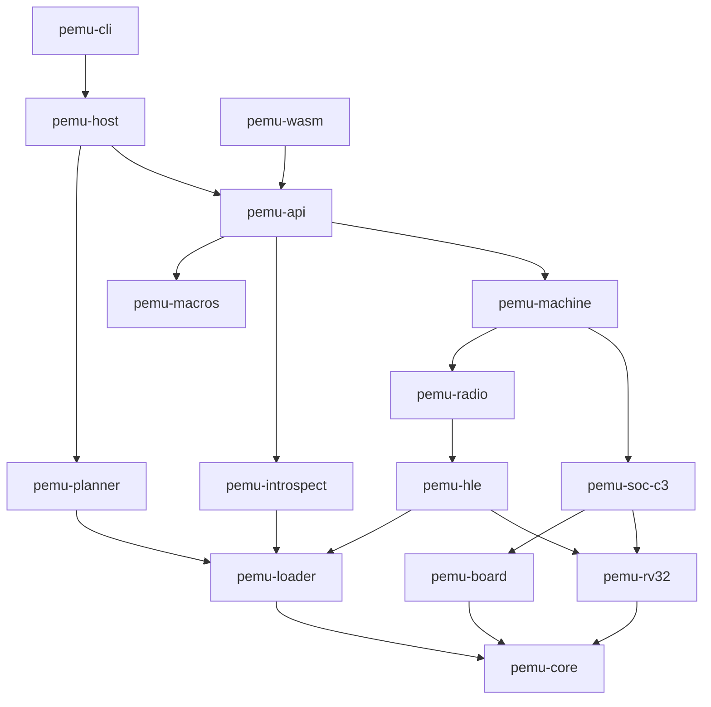
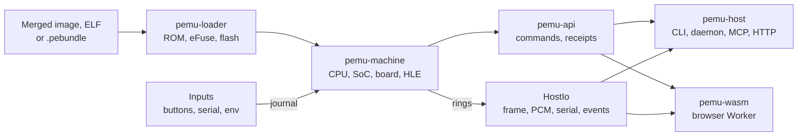

# 架构

[English](../../ARCHITECTURE.md) | **简体中文** | [日本語](../ja/ARCHITECTURE.md) | [Français](../fr/ARCHITECTURE.md)

PassportSim 模拟 FoloToy AI Passport：一块基于 ESP32-C3(rev v1.1，RV32IMC)的开发板，带有 ST7789 显示屏、ES8311 音频编解码器、CW2017 电量计、ADC 按键、NFC 卡和 USB Serial/JTAG。它运行与设备相同的合并 flash 镜像，从芯片真实的掩膜 ROM 开始执行，并且同一个核心既能原生运行，也能在浏览器中运行。

本文档描述当前的设计，以及仍在约束它的理由。代码才是第一手资料；本文档与代码不一致时，以代码为准，并修正本文档。

## 目标与原则

- **与设备相同的镜像。** 真实的 rev v1.1 ROM 原样运行，随后是二级引导程序和应用。固件中的任何内容都不打补丁。
- **一个核心，多种入口。** 同一组 crate 既编译到原生目标，也编译到 `wasm32-unknown-unknown`。命令行、MCP 服务、HTTP 和 WebSocket API、场景、浏览器页面、生成的文档和智能体技能都从同一个命令注册表生成。
- **核心内部只有虚拟时间。** 客户机永远看不到主机时间，因此一次运行完全由其输入决定。
- **失败即停，并说明原因。** 未建模的寄存器、无线绑定不匹配、卡住的轮询循环或无法唤醒的等待，都会以具名错误停止运行，而不是去猜测。
- **保真度要报告，而不是暗示。** 每个响应都带有回执，说明哪些是精确模拟、哪些是近似、哪些被访问但未建模。
- **机密默认不外泄。** 设备身份、校准数据和卡片内容不会进入仓库、日志、导出或智能体可见的输出(`docs/secrets.md`)。
- **小文件，各有归属。** 每个外设、板载芯片和命令各占一个文件，注册表由各条目在自己的文件中加入，因此并行修改很少冲突。

非目标：超出校准后 `device` 配置的周期精确流水线时序；模拟无线的 RF、PHY 或 MAC 寄存器，或运行闭源的无线库；以主机串口设备的形式出现(串口工具通过 TCP 连接)；Linux 和 Intel Mac 主机；GDB 远程调试桩。

## 仓库结构

| 路径 | 内容 |
|---|---|
| `crates/` | Rust 工作区(见下一节) |
| `web/` | 浏览器页面：TypeScript、React，用 Bun 构建和测试，Playwright 端到端测试 |
| `specs/` | 每行都注明出处的行为数据：寄存器 CSV、按模块划分的 TOML、时序配置、HLE 绑定配置、说明 |
| `boards/ai-passport.toml` | 开发板描述：时钟、flash 型号、启动配置引脚、引脚、电池和电源参数 |
| `assets/rom/` | Espressif ROM ELF(Apache-2.0)，内嵌到可执行文件中，附带校验值和许可证 |
| `probes/` | 在真实芯片上运行、用于测量行为的 ESP-IDF 探针固件；构建出的 ELF 已提交 |
| `tests/` | 工作区测试(`tests/milestones/`)、golden、场景、transcript、测试数据 |
| `tools/oracle/` | 把 Espressif QEMU 作为黑盒 oracle 运行的脚本(仅 macOS) |
| `skills/passportsim/` | 随每个发布包分发的智能体技能 |
| `xtask/` | 开发任务：代码生成、检查、CI 层级、性能基准、打包 |
| `docs/` | 本文档、概述、快速入门、机密数据策略、生成的命令参考，以及 `docs/i18n/` 中的翻译 |

## Crate

| Crate | 职责 |
|---|---|
| `pemu-core` | 虚拟时间、时钟、调度器、确定性随机数、输入日志、寄存器存储、主机 I/O 环形缓冲区、快照编解码、trace 记录、共享 AES |
| `pemu-rv32` | 解码器、操作、CSR、陷阱、PMP、块缓存引擎、参考单步解释器、开销模型、`Bus` trait |
| `pemu-soc-c3` | 内存区、页表、MMU 和缓存、flash 存储、MMIO 映射、中断矩阵、DMA 视图、每个外设一个文件、每种跨模块联动效果一个文件、生成的寄存器表 |
| `pemu-board` | 板载芯片 trait 和 Passport 上的芯片：面板、背光、编解码器、电量计、电池、按键电阻网络、电源轨、USB 插头、NFC 标签 |
| `pemu-loader` | ELF 和符号、ESP 镜像和应用描述符、分区表、内置 ROM 及其校验值、eFuse 合成与导入、`.pebundle` |
| `pemu-hle` | 高层模拟：挂钩集合、魔术返回 PC、绑定、嵌套客户机调用、续延、tripwire、从镜像恢复符号 |
| `pemu-radio` | 基于 VHCI 的 BLE 控制器、虚拟空中接口和中心设备、Wi-Fi 驱动模型、虚拟局域网(smoltcp)、堆账本 |
| `pemu-machine` | 组装、运行循环、停止条件、轮询和 ROM 延时快进、卡死和死锁检测、睡眠、快照、分叉、状态哈希 |
| `pemu-introspect` | DWARF 布局、栈回溯、FreeRTOS、堆和 LVGL 遍历器、panic 解码、经过遮盖的 NVS 列表 |
| `pemu-api` | 命令注册表和命令、会话池、输出整形、遮盖、匹配器、回执、场景、时钟租约、宿主接缝 |
| `pemu-macros` | `#[command]` 注册 |
| `pemu-planner` | 纯函数的烧录规划器和拒绝规则；真机执行需启用 `device` 特性 |
| `pemu-host` | 原生宿主：守护进程和实例池、主机目录、平台服务、MCP、HTTP 和 WebSocket、USB Serial/JTAG 端点、中继、产物、启动缓存 |
| `pemu-cli` | `passportsim` 可执行文件 |
| `pemu-wasm` | 浏览器 Worker 调用的原始 C ABI，以及与 TypeScript 共享的环形缓冲区布局 |
| `pemu-testkit`、`pemu-verify` | 测试支持：语料库定位、寄存器测试台、模拟开发板和机器、golden 运行器、串口输出规范化、容差带、trace 和 oracle 对比、校准拟合 |
| `tests/milestones`(`pemu-milestones`) | 启动真实镜像的集成测试，每个文件一个测试目标 |

### 分层



依赖边具有传递性：一个 crate 可以依赖它能到达的任何 crate。`cargo xtask layering` 检查以下规则：

1. **核心 crate 能编译到 wasm，且不接触宿主。** 除 `pemu-host`、`pemu-cli`、测试 crate、`xtask` 以及启用 `device` 特性的 `pemu-planner` 外，所有 crate 都能编译到 `wasm32-unknown-unknown`，不使用 `std::time`、`std::thread`、`std::fs`、`std::env`、`std::net` 或 `std::process`，不使用平台数学函数，也不使用会影响状态的哈希表迭代。
2. **外设从不直接引用另一个外设。** 跨模块效果(DMA、时钟变化、中断、复位)通过由机器执行的 `Wiring` 变体传递。
3. **板载芯片从不读取 SoC 寄存器**，SoC 只引用板载 trait。
4. **HLE 和无线代码只通过 `HostIo` 环形缓冲区和记入日志的输入接触宿主。**
5. **只有启用 `device` 特性的 `pemu-planner` 会打开串口设备。** 其他地方都由 `pemu_host::paths::refuse_device` 在打开之前拒绝设备路径(`/dev/cu.*`、`COM<n>`、`\\.\` 命名空间)。
6. **宿主相关代码放在 `pemu_host::platform`**，目录角色放在 `pemu_host::paths`；其他 crate 都不带 `cfg(target_os)`。
7. **第三方许可证**仅限 `deny.toml` 中的宽松许可证集合；GPL、LGPL、AGPL 和无许可证的 crate 会被拒绝。

## 数据流



- **加载。** 加载器根据 eFuse 中的芯片版本选择内置 ELF 并构建 ROM 镜像，校验其 SHA-256，在未提供转储时合成默认 eFuse(占位 MAC，以及能让 ADC 校准初始化的块版本)，然后映射 flash 镜像。替代设置(`--rom`、`PASSPORTSIM_ROM`、配置文件)只在原生环境中有效。
- **输入**(按键、串口字节、USB 线路状态、麦克风数据块、网络帧、HCI 数据包)带上虚拟时间戳后追加到输入日志中。模型只消费记入日志的输入，因此一次会话和它的回放会在相同时刻看到相同的字节。追加入口只有一个，即 `Machine::input_from`，每条输入都记录其来源(端点、UI、桥接)。
- **输出**通过核心内存中固定容量的环形缓冲区送出：帧缓冲、音频输出、两个控制台和事件。在 wasm 中它们位于线性内存，Worker 通过类型化视图读取，因此不会逐字节或逐像素跨越 JavaScript 边界。
- **命令**是唯一的控制路径。UI、命令行和智能体都调用同一个注册表，因此 UI 会话的输入日志与智能体的完全相同。

## 核心抽象

- **引擎。** 基本块在控制流和 CSR 操作处、64 条指令之后或 4 KB 页边界处结束，通过对操作类型的 `match` 分派。陷阱是精确的，指令预算是精确的，中断只在两次 `run` 调用之间处理，基本块边界不可观察，因此块缓存是派生状态，从不写入快照。引擎和 `ref_step` 在块大小为 1、3 和 64 时相互进行模糊测试。
- **内存。** 一个内存区容纳 ROM、SRAM、RTC RAM 和 8 MB flash。页表提供快速的加载和存储；MMIO、冷页和权限拆分的页走慢速路径。访问保持原有的宽度和字节偏移：不会把窄写入扩展成读改写。
- **外设。** `periph/mod.rs` 中有一张 `c3_devices!` 表(名称、基址、大小、模型)，MMIO 映射、快照段和复位分发都由它生成。尚无模型的模块为 `StoreOnly`：读取返回存储的值，写入被存储，每个寄存器第一次被访问时记入保真度账本。
- **开发板。** 芯片在 `BoardPorts` 之后实现 `I2cDevice`、`SpiDevice`、`I2sCodec` 等 trait；参数来自 `boards/ai-passport.toml`，出处记录在 `specs/` 中。
- **HLE。** 被挂钩的函数成为引擎的挂钩终止点。处理函数是可序列化的状态机，可以通过未使用的 ROM 空隙中的魔术返回 PC 回调客户机代码，并防范栈溢出和恢复已删除任务的情况。
- **机器门面。** `MachineApi`(run、input、io、now、客户机内存、回执、污染标记)是对象安全的；`SnapshotMachine` 增加快照、恢复、分叉、遮盖和 `state_hash`。停止条件是由断点、监视点和匹配器组成的一个 `StopSet`。
- **快照。** 每个段都有版本号和固定字节的测试；任何段布局变化都要提升 `pemu-core/src/snap.rs` 中的 `FORMAT_VERSION`。派生状态(块缓存、页表、挂钩)会重建，从不保存。运行身份不同的快照会以 `SnapError::IdentityMismatch` 被拒绝。连接实时桥接时，恢复和回退会被拒绝，分叉需要显式策略，因为主机端的对端不在快照中。
- **命令。** 一个命令就是 `pemu-api/src/commands/` 下的一个文件，包含参数和输出类型、处理函数、文本渲染器和示例。原生构建通过 `linkme` 注册，wasm 通过 `pemu-wasm/build.rs` 生成的列表注册。错误码按能力组分段(核心低于 1000，音频 1000，无线 2000，NFC 3000，调试 4000，设备 5000，电源 6000)；已发布的错误码保持名称和编号不变。

### 冻结接口

以下类型被许多文件共享，只在深思熟虑后修改：`Bus`、`Op`、`Peripheral`、`Cx`、`Wiring`、`RegStore`、`HostIo`、快照编解码和 `snap_struct!`、板载芯片 trait、`GuestView`、`MachineApi`、`SnapshotMachine`、停止条件的结构、`CommandSpec`、`Output`、`ApiError`、回执，以及 wasm ABI 和 `pemu_wasm::layout`。扩展点 `RadioModule`、`IdlePolicy`、`OpFuser` 和 `ExecTier` 都有一个空操作的默认实现，并且它始终是合法的答案。

修改冻结接口要放在单独的 pull request 中，先于使用它的代码合入，在描述中写明原因，并在同一改动中更新本文档。添加带默认实现的方法，或在已有范围内新增错误码，不需要单独的改动。wasm 函数或布局有任何变化都要提升 `ABI_VERSION`；快照布局有任何变化都要提升 `FORMAT_VERSION`。

## 执行与时间

运行循环依次执行到期的日志输入、分派到期的事件、检查停止条件、处理 WFI 和中断，然后让引擎运行一段预算，预算在下一个事件或限制处结束。任何会改变到期事件的访问都会返回 `OkStop`，因此事件不会迟到。墙钟节奏控制在 `run` 之外：宿主传入虚拟时间上限，并在两次调用之间检查墙钟时间。

- **虚拟时间**随时钟位置推进：已退休的指令加上各类指令的额外周期。计数器(SYSTIMER、TIMG、RTC、看门狗)在读取时由虚拟时间计算，并把各自的闹钟安排为事件；没有任何东西逐拍计数。
- **WFI 和浅睡眠**直接跳到下一个事件。深睡眠复位 CPU 并保留 RTC 域。CPU 在复位后以晶振频率的一半运行。
- **时序配置**是 `specs/timing-profiles.toml` 中的数据，也是运行身份的一部分。`fast`(默认)让设备操作立即完成，每条指令计一个周期。`device` 根据真实芯片上的探针采集结果校准：各类指令的开销(跳转成功的分支、跳转、load-use、除法、MMIO 总线周期)、带流式填充和取指预读的 16 KB 8 路 FIFO flash 缓存、SRAM bank 冲突，以及 flash、SPI、I2C、SHA、ADC 和 USB 排空的总线时间。它在容差带内准确，而非周期精确。
- **轮询快进。** 当一个 MMIO 轮询循环在架构状态完全相同的情况下重复(相同的 PC、地址、值和寄存器，其间没有存储、事件、挂钩或时间读取)，机器会整轮跳过迭代，直到下一个可能改变该值的事件。它默认开启，不改变任何结果；无论是否开启，规范 trace 都把轮询记录为连续的一段。
- **ROM 延时快进。** ROM 的 `ets_delay_us` 循环按整轮迭代跳过，周期计数器和每个寄存器都与实际执行完全一致。该挂钩与 ROM 的 SHA-256 绑定。
- **卡死和死锁检测。** 轮询一个任何东西都无法改变的寄存器，或轮询的寄存器在超过 `stuck_ms` 虚拟时间内没有变化，会以 `E_STUCK` 停止，并指出对应的忙等待行。处于 WFI 的 hart 如果没有任何已路由的中断或待处理事件能唤醒它，或者 FreeRTOS 任务之间形成了互相等待互斥锁的环，会在等待变得无法唤醒的那一刻以 `E_DEADLOCK` 停止。`Deadlock` 表示客户机在等待输入。
- **节奏**在智能体调用之间为 `Paused`，对智能体、场景和 CI 为 `Max`，交互使用时为 `Wall`，浏览器播放声音时为 `Audio`。落后超过 250 ms 时会重新对齐：客户机以慢动作运行，虚拟时间从不跳跃。同一时刻只有一个持有者(智能体、UI、端点或场景)拥有时钟租约。实时桥接(真实网络、外部 HCI、实时麦克风)把节奏固定为真实时间，因为对端按主机时间应答。

## 确定性

- **运行身份**包括 ROM、flash 镜像、应用 ELF 和 eFuse 的哈希，`MachineConfig` 的哈希(开发板、配置、种子、脚本化环境、卡死设置)，以及输入日志。文本输入按解析后的结构计算哈希，而不是按文件字节，因此换行符和键的顺序不影响身份。
- **身份相同，输出就逐位相同：** 串口字节、规范的 MMIO 和中断 trace、画面帧、PCM 和 `state_hash`。
- **结果不受以下因素影响：** 主机(macOS、Windows、Node、Chrome、Edge、Firefox、Safari)、构建配置、块大小、时间片大小、快进、trace、节奏、暂停点或快照点。
- **状态路径中禁止使用：** 主机时钟、主机随机数、哈希表迭代、线程、浮点 NaN 载荷，以及最后几位在不同主机间有差异的平台数学库(由 `clippy.toml` 禁止；需要浮点时使用可移植的 `libm` crate)。客户机的熵来自带种子的 `DetRng`。
- **非确定性来源会记入日志。** 回执会标明 `deterministic`、`replayable` 或 `live`。
- **跨主机一致性。** `tests/milestones/cross_host/` 在内置 ROM 上用两种配置启动一个合成镜像，并把每一个摘要(包括快照字节)与 macOS 上录制并提交的 golden `tests/golden/cross-host/parity.txt` 对比。每台主机都在 T0 中检查它。

## 无线

BLE 和 Wi-Fi 在驱动边界处模拟；边界之上的一切都作为真实的客户机代码运行。

| 无线 | 被替换的部分 | 保持真实的部分 |
|---|---|---|
| BLE | `bt.c` 中的七个 VHCI 控制器函数 | NimBLE 主机、GATT、SMP、应用 |
| Wi-Fi | `esp_wifi_init`/`deinit`、公开的 `esp_wifi_*` API 和数据面挂钩 | lwIP、esp_netif、DHCP、mbedTLS、HTTP 客户端 |

- **要么精确绑定，要么不绑定。** 只有当每个被挂钩的函数在大小和屏蔽重定位后的代码哈希上都与 `specs/hle/idf-5.5.3/` 中的配置一致，且应用的 IDF 版本匹配时，模块才会绑定。不匹配时该无线功能被标记为 `unsupported image`，其余部分继续运行。
- **没有 ELF 时**，通过完整函数体的代码特征从镜像中恢复符号；只有当模块需要的所有名称都恰好找到一次时才会绑定。没有 ELF 的 Wi-Fi 只能通过这种方式绑定。
- **Tripwire** 设在闭源库的内部函数上，运行到那里时以 `E_TRIPWIRE` 停止，而不是触发一个难以理解的断言。
- **环境是脚本化的。** 虚拟 BLE 中心设备负责扫描、连接和使用 GATT；Wi-Fi 在虚拟局域网上加入脚本化的开放或 WPA2-PSK 接入点。允许列表内的端口桥接和外部 HCI 对端从原生宿主连接到真实世界；两者都属于实时桥接。

## 宿主入口

- **生成的入口。** 命令行(`passportsim <cmd>`)、MCP 工具(`passport_<cmd>`)、HTTP(`POST /v1/instances/{id}/commands/{name}`)、WebSocket、场景步骤、TypeScript 类型、命令参考和智能体技能都来自注册表。命令示例以 argv 数组形式保存，在 CI 中不经过 shell 直接运行。默认的 MCP 工具列表上限为 24 KB 的 JSON；音频、无线、NFC、电源、调试和设备组需要用 `--caps` 显式启用。
- **主机可用性**集中在一张表 `pemu_api::host_support::TABLE` 中。某个主机无法运行的命令会以 `E_HOST_UNSUPPORTED` 失败并给出替代方案；生成的文档展示完整矩阵，因此在每台主机上都相同。
- **宿主接缝。** `pemu-api` 是核心 crate，因此产物、场景文件、机器工厂、时钟和端点通过宿主在启动时填充的接缝接入(`pemu_host::backend::install`、`hooks::install`)。未填充的接缝会在运行时拒绝，并指出应由哪个安装函数填充。
- **输出节省 token。** 串口读取是基于游标的增量；UI 树是经过裁剪的文本形式，并支持差异；大数据写入产物文件，按路径和哈希返回。产物路径相对于产物根目录，使用正斜杠；只有 `status` 会报告根目录。
- **守护进程。** 没有守护进程运行时，`passportsim start` 会以分离方式启动 `passportsim serve --headless`，让智能体的多次调用共享实例。发现机制是运行时目录中的一个文件，保存端口和 bearer 令牌；是否失效通过连接来判断，从不依赖进程 ID。守护进程空闲 10 分钟后退出。每个实例在自己的线程上运行，栈大小为 8 MiB。
- **服务器。** HTTP、WebSocket、MCP streamable HTTP 和静态 UI 共用一个回环监听器，它要求 bearer 令牌或会话 cookie，检查 `Host` 和 `Origin`，并发送 COOP/COEP 响应头。命令行打开 UI 时在 URL 片段中带上一次性启动码，该启动码会被换成一个 `HttpOnly`、`SameSite=Strict` 的 cookie。
- **USB Serial/JTAG 端点。** TCP 端点根据最初的几个字节识别 RFC 2217、原始 esptool SLIP 或普通控制台。烧录使用 `rfc2217://127.0.0.1:<port>`(esptool 无法通过 `socket://` 执行复位序列)；监视两者皆可。pty 端点仅在 macOS 上提供。
- **主机目录**(配置、数据根目录、缓存、运行时、日志、产物)只由 `pemu_host::paths::HostPaths` 解析：macOS 上为 `~/.config/passportsim` 和 `~/Library/Application Support/passportsim`，Windows 上为已知文件夹(从不使用环境变量)。`PASSPORTSIM_HOME`、`PASSPORTSIM_CONFIG_DIR` 和 `PASSPORTSIM_DATA_ROOT` 可以覆盖它们；机密检查忽略这些覆盖。私有文件从创建起就仅属主可访问。
- **外部工具**(esptool、IDF 工具链)从显式参数和 IDF 环境中解析，从不通过 `PATH` 查找，也从不通过 `.bat`、`.cmd` 或 `.ps1` 包装脚本运行。

### 烧录真实设备

烧录真实设备只能通过原生命令行，需要启用 `device` 特性的构建，支持 macOS 和 Windows。各步骤按固定顺序执行，确保在计划被证明可行之前不会触碰设备：发现(按 VID/PID 枚举，不打开端口)、规划(纯函数，离线)、预演(对一个使用真实分区布局的模拟器执行完全相同的 esptool 调用)、确认、识别、保护 `cardid` 区域、备份每个将要写入的扇区、写入、校验、启动检查。规划器从不写入 `nvs`、`phy_init` 或 `cardid`，从不整片擦除，也从不写 eFuse；`cardid` 摘要发生变化时以 `E_CARDID_CHANGED` 停止。

## 网页

```text
Main thread (React)          Emulator Worker (wasm core)           AudioWorklet
 device, panels, input  -->   input: SAB ring or postMessage        playback ring -> output
 console, log           <--   pacing loop, slices of about 8 ms     microphone -> ring
                              OffscreenCanvas WebGL frame
```

- **运行时。** 核心在一个专用 Worker 中单线程运行。页面跨源隔离时，各 JavaScript 部分之间使用 SharedArrayBuffer 环形缓冲区，否则回退到 `postMessage`。所有浏览器引擎的定时器精度都较粗，因此 Worker 用 `Atomics.wait` 等待，用 `Atomics.waitAsync` 让出(缺少它时用 MessageChannel)。
- **界面。** React 配合内置的 coss ui 组件(MIT)和 Tailwind，不使用 CDN，构建产物是扁平的(`index.html`、`styles.css`、`main.js`、`worker.js`、`worklet.js`)。简洁模式显示设备、固件卡片和日志；高级模式增加运行控制、控制台、UI 树、事件、检查、保真度和环境卡片。支持英文、简体中文、日文和法文；首次访问时跟随系统语言。
- **设备视图**使用 FoloToy 的 AI Passport 正面产品照片(见 `THIRD_PARTY.md`)，模拟的屏幕叠加在照片中的屏幕位置，侧面按键就是操作控件(几何参数在 `web/src/app/skinGeometry.ts` 中)。缩放可选适应窗口，或 60 x 95 mm 机身的 100、140、180 %；栏宽足够时适应窗口不会低于 140 %，以保证固件文字清晰可读。屏幕上始终显示 `Emulator` 标记，避免截图被误认为是真机照片。按键发送按下和松开两个边沿，至少保持 80 ms 客户机时间。
- **每个控件都调用一个注册表命令**，每条记录的操作都可以复制为命令行命令或场景步骤。
- **数据不离开浏览器。** 页面只对自身文件发出 GET 请求。固件、快照、截图和固件历史(IndexedDB，最多 12 条或 160 MiB)都保存在本地。
- **停止总会说明原因。** panic、tripwire、停机或无法唤醒的等待都会显示原因，并提供重启或继续的选项；停止期间禁用输入。
- **加载。** 没有输入时，页面启动内置的演示固件。拖入的 `idf.py` 构建目录、合并 bin、ELF 或 `.pebundle` 会替换它。

## 打包

`cargo xtask package --target <triple>` 为每种主机构建一个自包含的可执行文件：`passportsim-<version>-macos-arm64.tar.gz` 和 `passportsim-<version>-windows-x64.zip`。可执行文件内嵌网页、同一提交的 wasm 核心、schema、智能体技能、内置 ROM 和预构建的演示固件；内嵌的 payload 在不同主机上逐字节相同，其哈希记录在发布包回执中。Windows 构建静态链接 CRT，并内嵌一个声明长路径支持和 UTF-8 代码页的清单；如果可执行文件导入了 Visual C++ 运行库，发布包检查会失败。同一命令还会写出静态网页包及其 Cloudflare Workers 项目(`docs/deploy-cloudflare.md`)。

## 安全

完整策略见 `docs/secrets.md`。简而言之：MAC 地址、唯一 ID、校准字、备份文件名和卡片内容都不会进入仓库或智能体可见的输出；示例使用 `02:00:00` MAC 前缀。同一个构建器 `pemu_api::secret_set` 同时供遮盖流程和 `cargo xtask secrets-check` 使用，后者由 git hook 在每次提交和推送时运行。由真实 eFuse 转储构建的机器被标记为受污染：它的导出会被遮盖，启动缓存只保存在内存中。

## 验证

| 层次 | 内容 | 位置 |
|---|---|---|
| 单元和模型测试 | 生成的寄存器测试、外设测试台、按数据手册时序测试板载芯片、I2C transcript | 各 crate |
| CPU 一致性 | riscv-tests、ESP CSR 测试、用 objdump 解码每条 ROM 和语料库指令、引擎与 `ref_step` 的模糊对比 | `pemu-rv32`、`xtask riscv-tests` |
| golden 启动和场景 | 串口文本与设备输出行及容差带对比、画面与 PNG golden 对比、脚本化场景 | `tests/milestones`、`tests/golden`、`tests/scenarios` |
| 确定性 | 运行两次、块和时间片大小、快进开关、停止不变性、任意点快照、恢复等价性、原生与 wasm 对比、跨主机一致性 | `pemu-machine`、`xtask ci` |
| oracle 对比 | 写入序列和调用 trace 与作为黑盒运行的 Espressif QEMU 对比 | `pemu-verify`、`xtask oracle`(macOS) |
| 浏览器 | macOS 上在 Chromium、Firefox 和 WebKit 中运行 Playwright；Windows 上在 Chromium、Chrome、Edge 和 Firefox 中运行 | `web/tests` |
| 性能 | 带 10 % 回退门槛的负载基准、浏览器 CPU 占用 | `xtask bench`、`xtask bench-browser` |

- **规格表。** `specs/c3-registers.csv` 和 `specs/blocks/<block>.toml`(复位域、忙等待行、覆盖项)由 `cargo xtask codegen` 合并为生成的寄存器表和 `docs/fidelity.md`。每一行都注明出处；`cargo xtask provenance` 检查引用和净室规则([CONTRIBUTING.md](CONTRIBUTING.md#净室规则))。
- **保真度等级。** A：与设备一致(有与采集结果对应的测试)。B：与规格一致，并有 oracle 或源自 IDF 的测试。C：声明过的近似。U：未建模。只有配上能证明它的测试，等级才会提升。
- **探针固件**位于 `probes/`，测量芯片行为(时序、复位、时钟、中断、无线)，并输出机器可读的行，模型据此拟合和检验。
- **CI 层级。** `cargo xtask ci t0` 不需要语料库或设备数据，在每台主机上运行。`t1` 增加固件语料库、golden 和浏览器测试；`t2` 增加长时间的确定性运行、oracle 对比和性能基准。测试按名称加入层级：`t1_*` 和 `t2_*` 测试在对应层级运行，T0 运行整个工作区。每次运行都会写出一份 JSON 回执。
