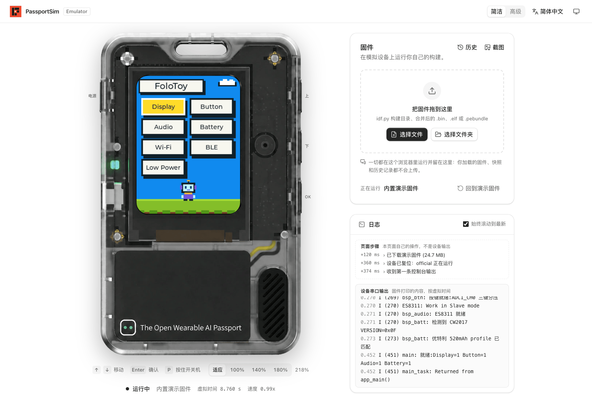
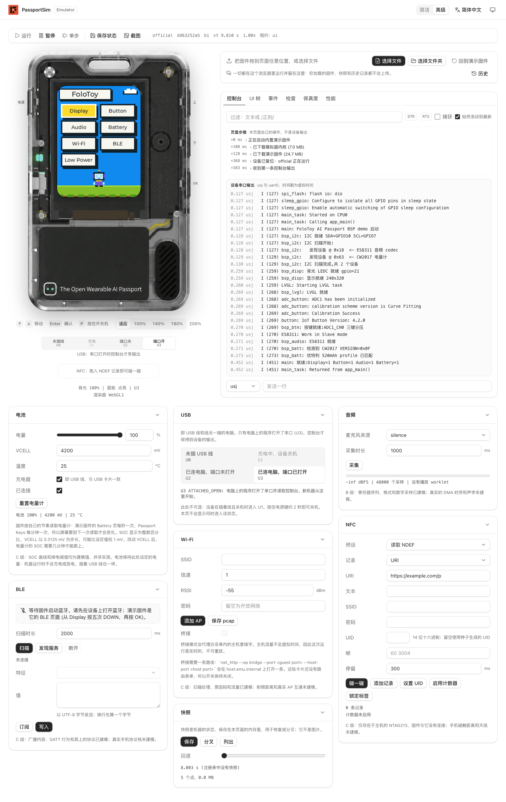
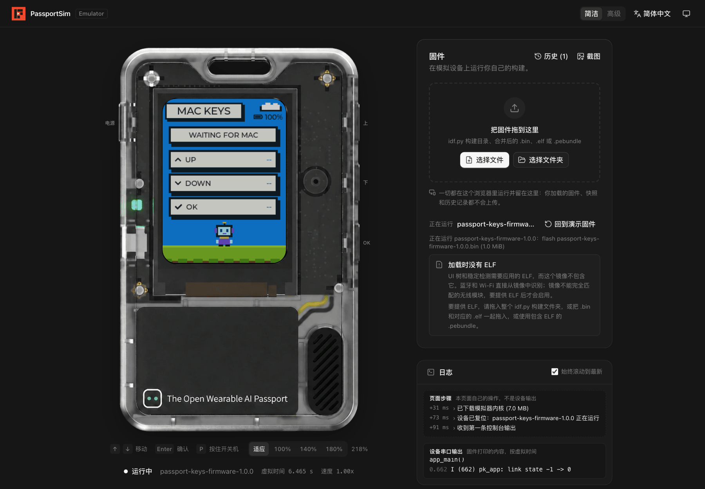
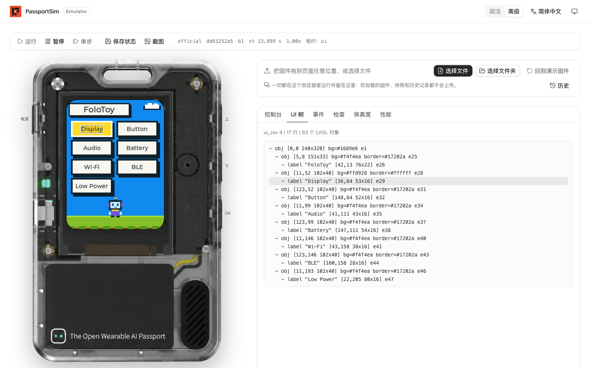

<div align="center">

<h1 align="center">
  <picture>
    <source media="(prefers-color-scheme: dark)" srcset="../../images/logo-full-dark.svg">
    
  </picture>
</h1>

**无需真机，即可开发和调试 FoloToy AI Passport 固件。**<br>
在浏览器或桌面上直接运行未经修改的 ESP-IDF 固件。

**在线试用：[passportsim.bugs.cc](https://passportsim.bugs.cc)**，无需安装。

[](../../../LICENSE)


[English](../../../README.md) | **简体中文** | [日本語](../ja/README.md) | [Français](../fr/README.md)



</div>

## 能做什么

- **没有设备也能运行固件。** 把构建产物拖到页面上，屏幕、按键、声音和串口输出都与真机一致。
- **调试固件。** 暂停、单步、保存和恢复状态，查看串口日志、UI 控件树、任务和内存。
- **运行别人的固件。** 合并后的 `.bin`、`idf.py` 构建目录或 `.pebundle` 都能直接运行。所有数据只留在你的浏览器里，不会上传。
- **自动化。** 提供命令行和 MCP 服务，可用于脚本、CI 和 AI 智能体。

## 快速开始

最快的方式是打开[在线版](https://passportsim.bugs.cc)，把固件拖到页面上即可。

从最新发布版安装命令行：

```sh
curl -fsSL https://passportsim.bugs.cc/install.sh | sh      # macOS(Apple 芯片)
```

```powershell
irm https://passportsim.bugs.cc/install.ps1 | iex           # Windows x64(PowerShell)
```

从源码构建并运行需要安装 [Rust](https://rustup.rs)、[Bun](https://bun.sh) 和 [just](https://github.com/casey/just)(也可以用 `make`)。

```sh
just setup    # 首次使用
just run      # 构建并打开网页界面 http://127.0.0.1:4173/
```

其他常用命令：

| 命令 | 作用 |
|---|---|
| `just cli start --fw official` | 运行命令行，参数原样传入 |
| `just test` | 运行单元测试 |
| `just package` | 为当前电脑构建发布包，输出到 `target/package/` |
| `just deploy` | 将网页界面发布到 Cloudflare Workers |
| `just` | 列出全部命令 |

使用 `make` 时，参数通过变量传入，例如 `make run PORT=8080`、`make cli ARGS="start"`。

## 在浏览器中使用

- **简洁模式**是默认界面：设备、固件拖放区和日志。
- **高级模式**增加运行控制、串口控制台、UI 控件树、事件录制，以及电池、USB、音频、NFC、Wi-Fi 和蓝牙的控制卡片。

界面支持中文、英文、日文和法文，以及浅色和深色主题。

<div align="center">

<br><sub>高级模式：运行控制、串口控制台，以及电池、USB、音频、Wi-Fi、蓝牙、NFC 和快照卡片</sub>
</div>

<div align="center">

<br><sub>加载自己的固件(图中为 Passport Keys)</sub>
</div>

## 使用命令行

```sh
just package
cd target/package/passportsim-*-macos-arm64
./passportsim start                  # 启动演示固件
./passportsim start path/to/firmware.bin
./passportsim screenshot             # 把屏幕保存为 PNG
./passportsim serial read            # 读取串口输出
./passportsim stop
```

Windows 上的可执行文件是 `passportsim.exe`。各系统首次启动的说明见[快速入门](quickstart.md)。

## 配合 AI 智能体使用

`passportsim mcp` 是一个 MCP 服务，在 MCP 客户端中添加：

```json
{ "mcpServers": { "passportsim": { "command": "/path/to/passportsim", "args": ["mcp"] } } }
```

智能体可以启动固件、按键、等待某行串口输出、读取 UI 控件树和截图。用 `npx skills add BlackHole1/passportsim` 添加[智能体技能说明](../../../skills/passportsim/SKILL.md)，或把 `skills/passportsim/` 复制到智能体的技能目录。

<div align="center">

<br><sub>智能体读取的 UI 控件树，鼠标所指的控件会在屏幕上框出</sub>
</div>

## 支持的系统

| | |
|---|---|
| macOS(Apple 芯片) | 支持 |
| Windows 10 及以上，x64 | 支持 |
| 浏览器 | Chrome、Edge、Firefox 和 Safari |
| Linux | 暂不支持 |

## 了解更多

| | |
|---|---|
| [工作原理](overview.md) | 模拟了哪些硬件、整体架构、确定性与保真度 |
| [快速入门](quickstart.md) | 发布包、首次启动、守护进程、网页包、Windows |
| [命令参考](../../commands/) | 每条命令的参数和错误码 |
| [部署到 Cloudflare](deploy-cloudflare.md) | 把网页界面发布为静态站点 |
| [架构设计](ARCHITECTURE.md) | 完整的设计文档 |

自动生成的参考文档(命令参考、错误码、`fidelity.md`、schema)以及 `THIRD_PARTY.md` 和 `LICENSE` 仅提供英文版。

## 参与贡献与许可证

欢迎参与贡献，请先阅读 [CONTRIBUTING.md](CONTRIBUTING.md) 和[行为准则](CODE_OF_CONDUCT.md)。安全问题请按 [SECURITY.md](SECURITY.md) 的说明报告。

本项目采用 MIT 许可证，见 [LICENSE](../../../LICENSE)。第三方材料列在 [THIRD_PARTY.md](../../../THIRD_PARTY.md) 中。FoloToy、AI Passport、Espressif 和 ESP32 均为其各自所有者的名称。
