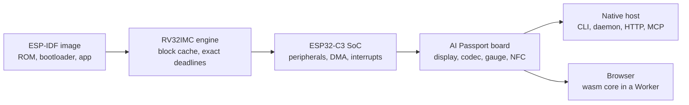

# PassportSim 的工作原理

[English](../../overview.md) | **简体中文** | [日本語](../ja/overview.md) | [Français](../fr/overview.md)

这里补充 [README](README.md) 背后的细节：模拟了什么、如何模拟、如何检验保真度，以及目前还做不到什么。设计细节见 [ARCHITECTURE.md](ARCHITECTURE.md)。

## 模拟了什么

| | |
|---|---|
| **整块开发板** | ESP32-C3(RV32IMC)及其外设、ST7789 显示屏和背光、ES8311 音频编解码器、CW2017 电量计、ADC 按键、NFC 和 USB Serial/JTAG |
| **真实的启动流程** | 先运行芯片的 ROM，再运行二级引导程序，最后运行你的应用，使用的正是你会烧录的那份合并镜像 |
| **看得见、摸得着** | 三种视图的截图(raw、glass、perceived)、按键、长按电源键、USB 插拔、电池电量和充电器 |
| **查看内部** | LVGL 控件树、FreeRTOS 任务、堆、NVS，以及一张保真度表，列出哪些是精确模拟、哪些是近似 |
| **虚拟世界** | 脚本化的 Wi-Fi 接入点、用于扫描、连接和 GATT 的 BLE 中心设备、带 NDEF 记录的 NFC 卡、播放单音或文件的麦克风 |
| **时间控制** | 运行到某行串口输出或某个事件出现为止、单步执行指令、按真实时间或尽可能快地运行、保存、恢复和分叉快照 |
| **现有工具** | `esptool` 和 `idf.py monitor` 通过 RFC 2217 串口端点连接模拟芯片，与连接开发板的方式相同 |
| **场景** | 带 JUnit 报告的脚本化测试运行，可用于 CI 或智能体的交付说明 |
| **安全地操作真机** | 可选的烧录工具：规划每一次写入，先在模拟器上预演，事先备份整个 flash，绝不触碰标识设备的区域 |

## 架构

核心 crate 是纯 Rust 代码，可以编译到原生目标和 `wasm32-unknown-unknown`，自身不访问时钟、线程、文件或网络。这些能力由宿主通过窄接口提供，因此运行结果是确定的，同一台模拟机器可以运行在命令行、守护进程或网页之后。

## 确定性

相同的镜像和输入，在 macOS 和 Windows 上产生相同的指令、串口输出和像素。两种主机上的每次 CI 运行都会把一个固定场景与 macOS 上录制并提交的 golden 逐条指令、逐个像素地对比。

## 保真度

- **以芯片为准。** 寄存器行为和时序来自公开文档、Apache-2.0 许可的 ESP-IDF 源码，以及在真实芯片上运行的探针固件。`specs/` 中的每一行行为数据都注明来源，并带有保真度等级。
- **净室。** 不阅读、不复制任何 GPL、LGPL 或无许可证的模拟器源码；其他模拟器只作为黑盒 oracle 运行([CONTRIBUTING.md](CONTRIBUTING.md#净室规则))。
- **三个测试层级**，用 `cargo xtask ci t0|t1|t2` 运行(`just ci` 运行 T0)：单元测试和集成测试、golden 画面和 trace、在 Chromium、Firefox、WebKit 和 Edge 中的浏览器测试，以及按引擎和主机设定的性能下限。

## 浏览器页面

核心编译为 WebAssembly，在 Web Worker 中运行，实时提供开发板的屏幕、音频和串口控制台。页面只发出获取自身文件的 GET 请求：固件、快照、截图和固件历史都留在浏览器里。页面可以由 `passportsim serve`、`just run` 提供，也可以作为静态站点部署([deploy-cloudflare.md](deploy-cloudflare.md))。

## 已知限制

- **无线功能需要 ESP-IDF v5.5.3。** 蓝牙和 Wi-Fi 只能绑定用 IDF v5.5.3 构建的固件。其他版本会一直运行到第一次访问无线功能，然后以一个具名错误停止。没有应用 ELF 时，只有在镜像中找到所需挂钩的全部函数，无线功能才能绑定。
- **无线环境是虚拟的。** 蓝牙只与内置的虚拟中心设备通信，从不连接真实手机；不支持配对、扩展广播以及固件作为中心设备。Wi-Fi 以 station 身份加入脚本化的开放或 WPA2-PSK 接入点，不能访问互联网；不支持 SoftAP。连接本机服务的端口桥接只在原生守护进程中可用。
- **电池不会自行充放电。** 电量只在你设置时改变。
- **时序默认是近似的。** 默认的 `fast` 配置会让硬件操作立即完成。经过校准的 `device` 配置(命令行 `--profile device`，网页不提供)接近开发板，但不是周期精确的。
- **网页中的快照只存在于页面内。** 快照和回退历史(20 个时间点，每 2 秒一个)保存在页面内存中，无法导出；命令行有 `snapshot export`。
- **部分模块只存储写入的值。** RMT、TWAI、UHCI、HMAC、数字签名模块、专用 GPIO、world controller 和 XTS-AES 没有实际行为，因此 flash 加密不可用。睡眠只能由定时器或 GPIO 电平唤醒。
- **音频细节有差异。** 编解码器的麦克风增益不生效，回声消除的参考信号读到的是静音，命令行把声音保存为 WAV 文件而不是播放出来。
- **没有真正的串口设备。** 串口工具通过 TCP 连接(`rfc2217://` 或 `socket://`)；pty 仅在 macOS 上可用。
- **烧录真实设备**需要从源码构建并启用 `device` 特性的命令行；网页从不烧录设备。
- **主机。** 支持 Apple 芯片的 macOS 和 x64 的 Windows 10 或更新版本。Linux 和 Intel Mac 没有构建版本。
