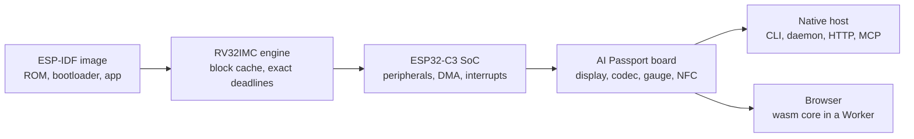

# How PassportSim works

**English** | [简体中文](i18n/zh-CN/overview.md) | [日本語](i18n/ja/overview.md) | [Français](i18n/fr/overview.md)

The details behind the [README](../README.md): what is emulated, how, how its fidelity is
checked, and what it cannot do yet. The design is in [ARCHITECTURE.md](ARCHITECTURE.md).

## What is emulated

| | |
|---|---|
| **Whole board** | ESP32-C3 (RV32IMC) with its peripherals, the ST7789 display and backlight, the ES8311 audio codec, the CW2017 battery gauge, the ADC buttons, NFC and USB Serial/JTAG |
| **Real boot path** | The chip's ROM runs, then the second-stage bootloader, then your application, from the same merged image you would flash |
| **See and touch** | Screenshots in three views (raw, glass, perceived), button presses, power holds, USB plug and unplug, battery level and charger |
| **Look inside** | The LVGL widget tree, FreeRTOS tasks, heap, NVS, and a fidelity table of what is modelled exactly and what is approximated |
| **Virtual world** | Scripted Wi-Fi access points, a BLE central for scans, connections and GATT, an NFC card with NDEF records, a microphone that plays a tone or a file |
| **Time control** | Run until a console line or event matches, step instructions, run in real time or as fast as possible, save, restore and fork snapshots |
| **Existing tools** | `esptool` and `idf.py monitor` reach the emulated chip over an RFC 2217 serial endpoint, as they would the board |
| **Scenarios** | Scripted test runs with JUnit reports, for CI or an agent's delivery note |
| **Real device, safely** | An optional flasher that plans every write, rehearses it on the emulator, backs up the whole flash first and never touches the regions that identify the device |

## Architecture

The core crates are plain Rust that builds for native targets and for `wasm32-unknown-unknown`,
with no clock, thread, file or network access of their own. Hosts provide those through narrow
ports, so runs are deterministic and the same machine runs behind a CLI, a daemon or a web page.

## Determinism

The same image and inputs give the same instructions, console and pixels on macOS and on Windows.
Every CI run on either host compares a fixed scenario, instruction for instruction and pixel for
pixel, with a committed golden recorded on macOS.

## Fidelity

- **Silicon first.** Register behavior and timing come from public documentation, Apache-2.0
  ESP-IDF sources and probe firmware run on the real chip. Each behavior row in `specs/` cites its
  source and carries a fidelity class.
- **Clean room.** No GPL, LGPL or unlicensed emulator source is read or copied; other emulators
  are only run as black-box oracles ([CONTRIBUTING.md](../CONTRIBUTING.md#clean-room)).
- **Three test tiers**, run with `cargo xtask ci t0|t1|t2` (`just ci` runs T0): unit and
  integration tests, golden frames and traces, browser runs in Chromium, Firefox, WebKit and Edge,
  and performance floors per engine and host.

## The browser page

The core compiles to WebAssembly and runs in a Web Worker with the board's screen, audio and serial
console, in real time. The page sends nothing but GET requests for its own files: firmware,
snapshots, screenshots and the firmware history stay in the browser. It can be served by
`passportsim serve`, by `just run`, or as a static site ([deploy-cloudflare.md](deploy-cloudflare.md)).

## Known limitations

- **Radios need ESP-IDF v5.5.3.** Bluetooth and Wi-Fi bind only to firmware built with IDF
  v5.5.3. Other versions run until they first touch a radio, then stop with a named error.
  Without the app's ELF, a radio binds only if every function it hooks is found in the image.
- **The radio world is virtual.** Bluetooth talks to a built-in virtual central, never a real
  phone; pairing, extended advertising and firmware acting as a central are not supported. Wi-Fi
  joins scripted open or WPA2-PSK access points as a station, with no internet; SoftAP is not
  supported. A port bridge to services on your computer works only with the native daemon.
- **The battery does not charge or drain by itself.** Its level changes only when you set it.
- **Timing is approximate by default.** The default `fast` profile completes hardware operations
  at once. The calibrated `device` profile (`--profile device` on the command line, not offered
  on the web page) is close to the board, not cycle-exact.
- **Web snapshots stay in the page.** Snapshots and the rewind history (20 points, one every 2
  seconds) live in page memory and cannot be exported; the command line has `snapshot export`.
- **Some blocks only store what they are written.** RMT, TWAI, UHCI, HMAC, the digital signature
  block, dedicated GPIO, the world controller and XTS-AES have no behavior, so flash encryption
  does not work. Sleep wakes only on the timer or a GPIO level.
- **Audio differs in details.** The codec's microphone gain is not applied, the echo-cancellation
  reference reads silence, and the command line saves sound to WAV files rather than playing it.
- **No serial port.** Serial tools connect over TCP (`rfc2217://` or `socket://`); a pty is
  available on macOS only.
- **Flashing a real device** needs the command line built from source with feature `device`; the
  web page never flashes a device.
- **Hosts.** macOS on Apple silicon and Windows 10 or newer on x64. Linux and Intel Macs have no
  build.
